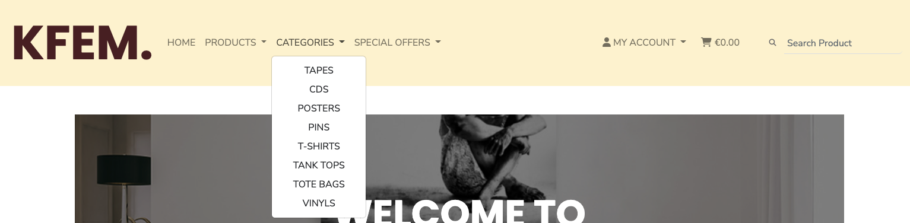
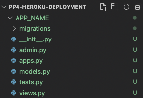

# **Kollektiv Fem [KFEM.]**
Kollektiv Fem [KFEM] is a small DIY record label, creative studio and webshop located in the north of Sweden. Risen from the ashes of Dreamnation Studios in 2018. Kollektiv Fem mainly focuses on releasing own art and other creative content like i.e. cassettes, vinyl records, t-shirts, compact discs, posters and pins. The site offers a webshop so that as many as possible can buy art in an easy way. The site also offers a blog that is handled by Kollektiv Fem with information about their latest releases and other relevant content for the site visitor. Kollektiv Fem is not only a webshop but also a digital spot on the web where everyone interested in art are welcome.

Even though this is a fictional size that most likely never will be published to the masses it is actually my (Marcus) DIY business where I release art that I have made. But for now this site was created for Portfolio Project #5 (E-Commerce Applications Portfolio Project) - Diploma in Full Stack Software Development Diploma at the [Code Institute](https://www.codeinstitute.net).

[View live website here](https://project-portfolio-5.herokuapp.com/)


# Table of Content

* [**Project**](<#project>)
    * [Objective](<#objective>)
    * [Site Users Goal](<#site-users-goal>)
    * [Site Owners Goal](<#site-owners-goal>)
    * [Project Management](<#project-management>)

* [**User Experience (UX)**](<#user-experience-ux>)
    * [Wireframes](<#wireframes>)
    * [User Stories](<#user-stories>)
    * [Site Structure](<#site-structure>)
    * [Design Choices](<#design-choices>)

* [**Existing Features**](<#existing-features>)
    * [Navigation](<#navigation>)
    * [About](<#about>)
    * [All](<#all>)
    * [Albums](<#albums>)
    * [Concerts](<#concerts>)
    * [Review Detail View](<#review-detail-view>)
    * [Update / Delete Comment](<#update-and-delete-comment>)
    * [Member Reviews](<#member-reviews>)
    * [Create Review](<#create-review>)
    * [Update Review](<#update-review>)
    * [Profile Page](<#profile-page>)
    * [Admin Area](<#admin-area>)
    * [Sign Up](<#sign-up>)
    * [Sign In](<#sign-in>)
    * [Sign Out](<#sign-out>)
    * [Footer](<#footer>)
    * [Flash Messages](<#flash-messages-and-confirmation-pages-to-the-user>)

* [**Features Left To Implement**](<#features-left-to-implement>)

* [**Technologies Used**](<#technologies-used>)
    * [Languages](<#languages>)
    * [Frameworks & Software](<#frameworks--software>)
    * [Libraries](<#libraries>)

* [**Testing**](<#testing>)
    * [Testing User Stories](<#testing-user-stories>)
    * [Code Validation](<#code-validation>)
    * [Additional Testing](<#additional-testing>)
    * [Known Bugs](<#known-bugs>)
* [Deployment](<#deployment>)
* [Credits](<#credits>)
* [Acknowledgements](<#acknowledgements>)

# **Project**

## Objective
As I mentioned in the Portfolio Project I absolutely love music, well actually all kinds of art. Therefore I have decided to make my existing Kollektiv Fem DIY business come to life in this project. I have decided to create a site as authentic I can and at the same time demonstrate my knowledge within the Django Framework, Python, JavaScript, CSS and HTML.

## Site Users Goal
The user of 'Kollektiv Fem' loves art of all forms and is excited to listen to and buy high quality art for a reasonable price.

## Site Owners Goal
The goal of the site owner is to deliver a site where the users in an intuitive way can buy Kollektiv Fems art and get relevant information of what is happening at Kollektiv Fem.

## Project Management

### Trello & Github Board
For this project I have used the applicatio [Trello](https://trello.com/) and the project board in GitHub to have control over my project. I just this setup on Project Portfolio 4 and it has worked really well this time also. Github was use to plan, create and organise my user stories whilst Trello was used from a more general perspective.

<details><summary><b>Trello & Github Board</b></summary>


</details><br/>

[Back to top](<#table-of-content>)

### Database Schema
I have used a modelling tool called [Graph Models](https://django-extensions.readthedocs.io/en/latest/graph_models.html) to create the database schema. In short it shows the relationships between the different models in the database connected to the application. Graph Models exports a *.dot file which easily can be converted to a more 'easy to read' design with the help of the application [dreampuf](https://dreampuf.github.io/GraphvizOnline/).

Models used (besides standard user model) in this project are:

**App: Blog**

* **Category** - Handles blog categories. I made this specific model to have a more dynamic handling of adding blog categorys.
* **Post** - Handles all the post blogs and also has a ForeignKey to the category which feed in the categories to the post model.

**App: Checkout**
* **Order** - Handles all customer orders. Holds delivery information but also generates i.e. order numbers and update totals. Has a foreign connection to the user_profile model.
* **OrderLineItem** - Keeps track of each order item in each order the customer with ForeignKeys to the Order and Product model.

**App: Products**
* **Tag** - I created a specific tag model to be able to add multiple tags to each product (i.e. Birthday, Fun, and so on).
* **Category** - Handles product categories.
* **Product** - Handles all products in the database, i.e. price, name, category and users_wishlist. The model has a ManyToMany connection to the User model to keep track of users wishlist.

**App: Profiles**
* **UserProfile** - Keeps track of all information connected to delivery information and order history. Also includes a method to create or update the user profile depending of if it exists or not.

<details><summary><b>Database Schema</b></summary>


</details><br/>

# **User Experience (UX)**

## Wireframes
The wireframes for the site were created in the software [Balsamiq](https://balsamiq.com). The wireframes have been created for desktop, tablet and mobile devices. The text content wasn't finalized during the wireframe process. It's also worth mentioning that there are some visual differences in the deployed version compared to the original wireframes, the reason being design choices that was made during the creation process.

<details><summary><b>Wireframes</b></summary>


</details><br/>

## User Stories
Below the user stories for the project are listed to clarify why particular feature matters. These will then be tested and confirmed in the [Testing](<#testing>) section.

### Viewing And Navigation

|  | | |
|:-------:|:--------|:--------|
| As a Customer | I can view a list of products so that I can read more about it and purchase it | &check; |
| As a Customer | I can click on a specific product so that I view its details like price, description, product rating, sizes and image | &check; |
| As a Customer | I can read the reviews that are connected to a specific product so that I can base my purchase decision on that | &check; |
| As a Customer | I can view the total of my purchases at any time so that I can keep track of my expenses | &check; |
| As a Site User | I can navigate easy on the site through paginated list of products and posts so that I feel comfortable using the site | &check; |
| As a Site User | I can view the site owners blog post so that I can get the latest information | &check; |
| As a Site User | I can contact Kollektiv Fem in an easy way so that I can interact with them if I have a need for it | &check; |
| As a Customer | I can like and unlike a review on a product I have purchased so that it is possible for me to raise my opinion | &check; |
| As a Site User | I can get visual feedback when interacting with the content so that I can be sure how I have interacted with the page | &check; |


### Registration And User Accounts
|  | | |
|:-------:|:--------|:--------|
| As a Site User | I can register an account so that I have a personal account and get access to my profile| &check; |
| As a Site User | I can have my own user profile so that I can view my personal order history, write reviews and update my contact / payment information| &check; |
| As a Site User | I can log out from the site so that I can feel safe that nobody can access my information | &check; |


### Sorting And Searching
|  | | |
|:-------:|:--------|:--------|
| As a Customer | I can sort the list of all products in different ways so that I can identify the best rated, best prices and products based on category| &check; |
| As a Customer | I can sort a specific category of products so that I can identify the best rated, best prices or just sort the products by name. | &check; |
| As a Customer | I can sort the list of products by using a single or multiple tags so that I can i.e. see all ’analog’ or ’ambient’ related products. | &check; |
| As a Customer | I can easily get information about what I have searched for and how many results the search generated so that I can see if the product is available.| &check; |

### Purchasing And Checkout
|  | | |
|:-------:|:--------|:--------|
| As a Customer | I can easily choose the quantity of a product and size if applicable when purchasing it so that that I ensure I get the correct product | &check; |
| As a Customer | I can easily view the items in my cart to be purchased so that I can see the total cost and all the items I am about to receive  .| &check; |
| As a Customer | I can easily adjust the amount of products in my cart so that I can change the cart before checking out | &check; |
| As a Customer | I can give my payment information in an easy way so that the checkout-process is quick and easy| &check; |
| As a Customer | I need to feel safe and secure when interacting with the site so that I feel comfortable to provide all necessary information needed for purchase | &check; |
| As a Customer | I view an order confirmation after checkout so that I can secure I have purchased the correct items and everything is ok | &check; |
| As a Customer | I will receive an email confirmation after the checkout process is done so that I can keep the information for future use if needed | &check; |
| As a Customer | I can receive an email confirmation when my order changes so that I get relevant information about my order | &check; |
| As a Customer | I can create a wishlist so that I can come back later to purchase the products | &check; |
| As a Customer | I can use a promotion code so that I can get a better deal | &check; |

### Site Admin

|  | | |
|:-------:|:--------|:--------|
| As a Site Admin | I can create, update and delete product posts so that I can manage my review content | &check;
| As a Site Admin | I can log out from the site so that I can feel safe that nobody can access my information | &check; |
| As a Site Admin | I can create draft product posts so that I can finish writing the content later | &check; |
| As a Site Admin | I can access an admin area so that I can get a general understanding of i.e. number of users, number of products| &check; |
| As a Site Admin | I can get visual feedback when interacting with the content so that I can be sure how I have interacted with the page | &check; |
| As a Site Admin | I can I can create, update and delete blog posts so that I can manage my blog content | &check; |
| As a Site Admin | I can create draft blog posts so that I can finish writing the content later | &check; |


[Back to top](<#table-of-content>)

## Site Structure

The Kollektiv Fem Site can be used in a *logged in* and *logged out* mode. Depending on the login status different pages are available for the user. When the user is logged out  the pages *home*, *products*, *categories*, *special offers*, *my account (register and login)* are available. When the user is logged in *my profile*, *my wishlist* and *logout* also is available. If you are logged in as an administrator *manage blog* and *manage products* is available as well. Worth mentioning is that the site has a clean, intuitive, and minimalistic design that makes the site visit a nice experience.

Read more about the different pages in the [Features](<#features>) section.

[Back to top](<#table-of-content>)

## Design Choices

* ### Color Scheme

The color scheme chosen for the 'Kollektiv Fem' site was based around the color **Raw Sienna** [#ce8147] which is being used mainly in the top bar and footer. Other colors being used besides black and white are: **Cornsilk** [#fff4d2], **Caput Mortuum** [#561d25]. Cornsilk is being used in the menu area and Caput Mortuum as nav brand color. I believe that the colors have a warm feel to it but at the same time clean and professional. The colors offers a good readability and contrast as well. I used the online service [Coolors](https://coolors.co/) to choose the color scheme.


* ### Typography
The fonts used for the site are **Nunito**, **Poppins'** and **Cousine**. Fallback font for Nunito and Poppins is **sans-serif** and fallback font for Cousine is **monospace**.

* 'Nunito' is used on more or less all body text on the site. It has quite a warm and nice look which I think worked really well on the bigger chunks of text on the site.

* 'Poppins' is used on the logo in the navigation bar and on all headlines (h1 - h6). It has a really clean look and works really well as header text.

* 'Cousine' is used on all product descriptions. Maybe a little bold decision to use this font but I think its 'alternative' look works really well in the context.


[Back to top](<#table-of-content>)

# **Features**
The features of the site are listed below.

## **Existing Features**

### **Top Bar**
The top bar is always visible and includes information about free shipping. The free shipping level is connected to a variable in settings.py.

<details><summary><b>Top Bar</b></summary>


</details><br/>

### **Navigation**

The navigation bar is includes the same basic options for the user (logged in or not logged in). If the user is logged in och logged in as an administrator the sub-menus look different.

*Basic Navigation*

* Home - Shows the user a carousel with two images and the latest blog posts
* Products - Lets the user sort/view the products by **added date**, **price**, **rating**, **name** and **all products**
* Categories - Lets the user sort/view the products by the categories **tapes**, **cds**, **posters**, **pins**, **t-shirts**, **tank tops**, **tote bags** and **vinyls**
* Special Offers -Lets the user sort/view the products by the tags **new arrivals** and **product of the month**
* My Account - Lets the user either **register an account** or **login**
* Cart - Views the total cost of the cart when the user starts adding to it. When the user clicks on it the **bag** template opens up.
* Search Box - Lets the user search for products on the page

<details><summary><b>Navigation</b></summary>


</details><br/>

<details><summary><b>Navigation - Products</b></summary>


</details><br/>

<details><summary><b>Navigation - Categories</b></summary>


</details><br/>

<details><summary><b>Navigation - Special Offers</b></summary>


</details><br/>

<details><summary><b>Navigation - My Account</b></summary>


</details><br/>


*Links that are visible to logged out users*

* About - Includes information about Review | Alliance and presents the reviewers that are registered.
* All - Lists all reviews on the site independent of category type of review.
* Albums - Lists all album reviews.
* Concerts - Lists all concert reviews.
* Login / Sign Up - Gives the user the opportunity to log in or sign up if not ready a registered user at Review | Alliance.


<details><summary><b>Navigation Small - User Not Logged In</b></summary>


</details><br/>

*Links that are visible to logged in users*

All of the links that are visible to a not logged in user plus the ones below.

* Create New Review - Lets the user create a new review.
* View My Reviews - Lists all reviews created by the logged in user.
* Show Profile Page - Shows logged in users profile page.
* Log Out - Logs out the user.

<details><summary><b>Navigation Large - User Logged In</b></summary>


</details><br/>

<details><summary><b>Navigation Small - User Logged In</b></summary>


</details><br/>

*Link that is visible if user is administrator*

All of the links above plus the one below.
* Admin Area - Gives the administrator a view with information about i.e. total number of users, number of comments and number of posts. In this view the administrator also can publish / unpublish / approve / unapprove reviews and approve / unapprove comments.

<details><summary><b>Navigation Large - Admin Logged In</b></summary>


</details><br/>

<details><summary><b>Navigation Small - Admin Logged In</b></summary>


</details><br/>

### **About**
In the about section the user can read about both who Review | Alliance are but also about all reviewers that are registered on the site.

<details><summary><b>About Section</b></summary>


</details><br/>

### **All**
This page lists all the reviews that has been made at Review | Alliance. If the user is not logged in there is only a "read more" option visible for the user on each review card. If the user is logged in an *update* and *delete* option gets visible on the reviews that the user has written. The page shows 6 cards on bigger screens before a pagination mechanism kicks in. On smaller screens the cards are stacked vertically.

<details><summary><b>All Reviews - User Logged Out</b></summary>


</details><br/>

<details><summary><b>All Reviews - User Logged In</b></summary>


</details><br/>

### **Albums**
This page lists all the album reviews that has been made at Review | Alliance. If the user is not logged in there is only a "read more" option visible for the user on each review card. If the user is logged in an *update* and *delete* option gets visible on the reviews that the user has written. No screenshots for this view due to the fact it's the same concept as in the all reviews section except that the review cards are filtered on the category 'album'.

### **Concerts**
This page lists all the concert reviews that has been made at Review | Alliance. If the user is not logged in there is only a "read more" option visible for the user on each review card. If the user is logged in an *update* and *delete* option gets visible on the reviews that the user has written. No screenshots for this view due to the fact it's the same concept as in the all reviews section except that the review cards are filtered on the category 'concert'.

### **Review Detail View**
The review detail shows the details about the review that the user has chosen in the all, albums or concert view. Depending on if the user is logged in the view looks a little bit different. If the user is logged in they get the possibility to like the review and also update and delete it if they have written it. A logged in user can also leave a comment (and update / delete their own comment as well).

<details><summary><b>Review Detail View - User Logged Out</b></summary>


</details><br/>

<details><summary><b>Review Detail View - User Logged In</b></summary>


</details><br/>

### **Update And Delete Comment**
If the user is logged in and has written a comment there is a possibility to edit and delete the comment. When the comment has been updated it needs to be re-approved by Review | Alliance.

<details><summary><b>Update Comment</b></summary>


</details><br/>

### **Member Reviews**
The Member Review Page lists the reviews that the logged in user has written. The user can update and delete their review on this page and also gets information about the status of the review. There are 4 different statuses:

* *Your review is awaiting approval* - Review has been submitted with the status 'published' and awaits approval
* *Your review is in draft status but is approved* - The review is in draft status but has been approved
* *Your review is published and approved* - The review is published and approved
* *Your review is in draft status* - The review has been submitted with the status 'draft'

<details><summary><b>Member Reviews</b></summary>


</details><br/>

### **Create Review**
On this page the registered and logged in user can create their own review. When they have sent it in Review | Alliance needs to approve it, until it's approved it will not be visible for the public.

<details><summary><b>Create Review</b></summary>


</details><br/>

### **Update Review**
On this page the registered and logged in user can update their own review. When they have updated it in Review | Alliance needs to re-approve it, until it's re-approved it will not be visible for the public.

<details><summary><b>Update Review</b></summary>


</details><br/>

### **Profile Page**
On this page the user can view and update their own profile page. The profile is visible in the about section.

<details><summary><b>Profile Page</b></summary>


</details><br/>

### **Admin Area**
On this page the administrator (or other superuser decided by Review | Alliance) can *approve* / *unapprove* / *publish* / *unpublish* and *delete* reviews and comments. General information about *number of users*, *number of comments*, *number of reviews*, *unapproved comments / reviews* is also being showed on the page.

<details><summary><b>Admin Area</b></summary>


</details><br/>

### **Sign Up**
If the site visitor has no registered user at Review | Alliance they can sign up. They can also add a presentation and upload a featured image that will be used on the users profile page.

<details><summary><b>Sign Up</b></summary>


</details><br/>

### **Sign In**
On this page the user can sign in to Review | Alliance

<details><summary><b>Sign In</b></summary>


</details><br/>

### **Sign Out**
When the user clicks sign out in the menu bar a confirmation page is being showed so that the user don't accidently sign out.

<details><summary><b>Sign Out</b></summary>


</details><br/>

### **Footer**
The footer area includes short information about Review | Alliance, contact information and links to relevant social media.

<details><summary><b>Footer</b></summary>


</details><br/>

### **Flash Messages and confirmation pages to the user**
The sites incorporates flash messages and confirmation pages when an action has been performed (i.e. delete/update actions). Examples of this in the screenshots below.

<details><summary><b>Confirmation Messages</b></summary>


</details><br/>

### Features Left to Implement

* Add more automated testing
* Add 'current page is active' in navbar
* Search reviews functionality from the navbar
* Information in the about section how many reviews each reviewer has made
* Add / remove genre and category in admin section
* Add image resize functionality
* Remove admin approval of comments

[Back to top](<#table-of-content>)

# Technologies Used

## Languages

* [Python](https://en.wikipedia.org/wiki/Python_(programming_language)) - Provides the functionality for the site.
* [HTML5](https://en.wikipedia.org/wiki/HTML) - Provides the content and structure for the website.
* [CSS3](https://en.wikipedia.org/wiki/CSS) - Provides the styling for the website.
* [JavaScript](https://en.wikipedia.org/wiki/JavaScript) - Provides interactive elements of the website

## Frameworks & Software
* [Bootstrap](https://getbootstrap.com/) - A CSS framework that helps building solid, responsive, mobile-first sites
* [Django](https://www.djangoproject.com/) - A model-view-template framework used to create the Review | Alliance site
* [Balsamiq](https://balsamiq.com/) - Used to create the wireframe.
* [Microsoft Excel](https://www.microsoft.com/sv-se/microsoft-365/excel) - Used to create testing scenarios.
* [Github](https://github.com/) - Used to host and edit the website.
* [GitBash](https://en.wikipedia.org/wiki/Bash_(Unix_shell)) - Terminal in [Gitpod](https://www.gitpod.io) used to push changes to the GitHub repository.
* [Heroku](https://en.wikipedia.org/wiki/Heroku) - A cloud platform that the application is deployed to.
* [Lighthouse](https://developer.chrome.com/docs/lighthouse/overview/) - Used to test performance of site.
* [Responsive Design Checker](https://www.responsivedesignchecker.com/) - Used for responsiveness check.
* [Wave Web Accessibility Evaluation Tool](https://wave.webaim.org/) - Used to validate the sites accessibility.
* [a11y Color Contrast Accessibility Validator](https://color.a11y.com/Contrast/) - Used to test color contrast on the site
* [Graph Models](https://django-extensions.readthedocs.io/en/latest/graph_models.html) - Used to create a *.dot file of all models in the project.
* [dreampuf](https://dreampuf.github.io/GraphvizOnline/) - Creates visually appealing database diagrams of *.dot files.
* [Favicon](https://favicon.io/) - Used to create the favicon.
* [VSCode](https://code.visualstudio.com/) - Used to create and edit the site.
* [Google Chrome DevTools](https://developer.chrome.com/docs/devtools/) - Used to debug and test responsiveness.
* [Trello](https://trello.com/en-GB) - A project management tool to organize the project.
* [Cloudinary](https://cloudinary.com/) - A service that hosts all static files in the project.
* [HTML Validation](https://validator.w3.org/) - Used to validate HTML code
* [CSS Validation](https://jigsaw.w3.org/css-validator/) - Used to validate CSS code
* [PEP8 Validation](http://pep8online.com/) - At the time for deploying this project the PEP8 Online Validaton service was offline, therefore not used.
* [JSHint Validation](https://jshint.com/) - Used to validate JavaScript code

## Libraries

[Back to top](<#table-of-content>)

The libraries used in this project are located in the requirements.txt file and have been documented below

* [asgiref](https://pypi.org/project/asgiref/) - ASGI is a standard for Python asynchronous web apps and servers to communicate with each other, and positioned as an asynchronous successor to WSGI.
* [cloudinary](https://pypi.org/project/cloudinary/) - The Cloudinary Python SDK allows you to quickly and easily integrate your application with Cloudinary. Effortlessly optimize, transform, upload and manage your cloud's assets.
* [dj3-cloudinary-storage](https://pypi.org/project/dj3-cloudinary-storage/) - Django Cloudinary Storage is a Django package that facilitates integration with Cloudinary by implementing Django Storage API.
* [Django](https://pypi.org/project/Django/) - Django is a high-level Python web framework that encourages rapid development and clean, pragmatic design.
* [django-allauth](https://pypi.org/project/django-allauth/) - Integrated set of Django applications addressing authentication, registration, account management as well as 3rd party (social) account authentication.
* [django-crispy-forms](https://pypi.org/project/django-crispy-forms/) - Used to integrate Django DRY forms in the project.
* [django-extensions](https://pypi.org/project/django-extensions/) - Django Extensions is a collection of custom extensions for the Django Framework.
* [gunicorn](https://pypi.org/project/gunicorn/) - Gunicorn ‘Green Unicorn’ is a Python WSGI HTTP Server for UNIX. It’s a pre-fork worker model ported from Ruby’s Unicorn project. The Gunicorn server is broadly compatible with various web frameworks, simply implemented, light on server resource usage, and fairly speedy.
* [oauthlib](https://pypi.org/project/oauthlib/) - OAuthLib is a framework which implements the logic of OAuth1 or OAuth2 without assuming a specific HTTP request object or web framework.
* [psycopg2](https://pypi.org/project/psycopg2/) - Psycopg is the most popular PostgreSQL database adapter for the Python programming language.
* [PyJWT](https://pypi.org/project/PyJWT/) - A Python implementation of RFC 7519.
* [pylint-django-2.5.3](https://pypi.org/project/pylint-django/) - A Pylint plugin for improving code analysis when analysing code using Django.
* [pylint-plugin-utils-0.7](https://pypi.org/project/pylint-plugin-utils/) - This is not a direct Pylint plugin, but rather a set of tools and functions used by other plugins such as pylint-django.
* [python3-openid](https://pypi.org/project/python3-openid/) - OpenID support for modern servers and consumers.
* [pytz](https://pypi.org/project/pytz/) - This is a set of Python packages to support use of the OpenID decentralized identity system in your application, update to Python 3
* [requests-oauhlib](https://pypi.org/project/requests-oauthlib/) - P    rovides first-class OAuth library support for Requests.
* [sqlparse](https://pypi.org/project/sqlparse/) - sqlparse is a non-validating SQL parser for Python. It provides support for parsing, splitting and formatting SQL statements.
* [cryptography-3.3.23](https://pypi.org/project/cryptography/3.3/) - Cryptography is a package which provides cryptographic recipes and primitives to Python developers.

# Testing

## Testing User Stories

* As a Site User | I can view a list of the music reviews so that I can select one to read
    * At the top of the site there is a navigation bar with a link that lists all reviews when the user clicks on it.

* As a Site User | I can view a list of the concert reviews so that I can select one to read
   * At the top of the site there is a navigation bar with a link that lists all concert reviews when the user clicks on it.

* As a Site User | I can click on a specific review so that I can read it in detail
   * At the top of the site there is a navigation bar with a link that lists all album reviews when the user clicks on it.

* As a Site User | I can like and unlike a review so that it is possible for me to interact with the review
    * When the user is logged it is possible to click on a heart on the review detail page to like / unlike a review.

* As a Site User | I can view the number of likes on each review so that I can see how popular a specific review is
    * On the review detail page the user can see how many likes the specific review has.

* As a Site User | I can contact Review Alliance in an easy way so that I can interact with them if I have a need for it
    * In the footer there is clear information about how to contact Review | Alliance.

* As a Site User | I can navigate easy on the site through paginated list of posts so that I feel comfortable using the site
    * On the review pages the pagination is activated when there are more than 6 reviews on a page.

* As a Site User | I can view comments on a specific review so that I can read the conversations between different users on the site
    * When the user clicks on a specific review the comment section can, in an easily way, be viewed.

* As a Site User | I can sign up an account so that I can like and comment on reviews, create a profile page, create own reviews and edit / remove my reviews
    * In the navigation bar the user can click the Login / Sign up link to either login or sign up for a new account. When this is done the user can interact on the page as stated in the user story).

* As a Site User | I can create a profile page so that other reviewers can read about who I am
    * If a user is registered and logged in there is a 'Show Profile'-page in the navigation menu where the user can fill in profile details. The profile is shown for the site users in the about section.

* As a Site User | I can comment on a review so that I can be involved in the conversation
    * When the user is logged in they can write a comment on a specific review on the review detail page.

* As a Site User | I can edit my comment so that I can change the content if needed
    * When the user is logged in an edit button appears on the all comments that the specific user has written. When the user clicks the edit button they can change the content in the comment.

* As a Site User | I can remove my review so that I have full control of my reviews
    * When the user is logged in a delete button appears on the all comments that the specific user has written. When the user clicks the delete button they get the option to delete the comment.

* As a Site User | I can choose to see my own reviews so that I can find them easily
    * When a user is logged in they can choose to view their own reviews through the link 'My Reviews'.

* As a Site User | I can create a new review so that I can contribute to with new content to Review Alliance
    * When a user is logged in they can create a new review through the 'Create New Review'-link in the navigation bar.

* As a Site User | I can log out from the site so that I can feel safe that nobody can access my information
    * When the user is logged in it is possible to choose the 'Log Out'-option in the navigation menu.

* As a Site User | I can create draft reviews so that I can finish writing the content later
    * When a logged in user creates a review they have the possibility to set the status on the review either on published or draft.

* As a Site User | I can get visual feedback when interacting with the content so that I can be sure how I have interacted with the page
    * When the user sign in, sign out, create / update / deletes reviews and comments they always get a confirmation message to secure visual feedback.

* As a Site Admin | I can log out from the site so that I can feel safe that nobody can access my information
   * When the admin is logged in it is possible to choose the 'Log Out'-option in the navigation menu.

* As a Site Admin | I can create, read, update and delete reviews so that I can manage my review content
    * When the user is logged in as an administrator / superuser a new item show up in the navigation menu called 'Admin Area'. In this area the user can read, update and delete reviews. Creation of reviews can be made the same way as any logged in user. Updating reviews can only be made if the administrator has written the original review.

* As a Site Admin | I can approve reviews so that I can secure high quality of the content
    * When the user is logged in as an administrator / superuser a new item show up in the navigation menu called 'Admin Area'. In this area the user can approve / unapprove / publish / unpublish reviews.

* As a Site Admin | I can approve and disapprove comments so that I can secure a safe environment for the Site Users
    * When the user is logged in as an administrator / superuser a new item show up in the navigation menu called 'Admin Area'. In this area the user can approve / unapprove comments.

* As a Site Admin | I can create draft reviews so that I can finish writing the content later
    * When a user is logged in as an administrator they have the possibility to create a review they and set the status to published or draft.

* As a Site Admin | I can access an admin area so that I can get a general understanding of logged in users, number of likes and number of posts
    * In the admin area there is an summary area in the top with general information about the site (i.e. number of users, number of reviews / comments that need approval)

* As a Site Admin | I can get visual feedback when interacting with the content so that I can be sure how I have interacted with the page
    * When the admin signs in, signs out, create / update / deletes reviews and comments they always get a confirmation message to secure visual feedback.

## Code Validation
The code on the 'Review | Alliance' site has been tested through W3C Markup Validation Service, W3C CSS Validation Service and JSHint. Errors were at first found on the site in the W3C Markup Validation Service but could quite easily be fixed (see bugs section). One error appeared as well in the W3C CSS Validation but that was connected to Font Awesome and not to the site code itself (see bugs section).

### Markup Validation
After fixing the inital errors that W3C Markup Validation Service reported, no errors were returned.

<details><summary><b>HTML Validation Result</b></summary>


</details><br/>

[Back to top](<#table-of-content>)

### CSS Validaton
When validating my own code the W3C CSS Validator reports no errors.

<details><summary><b>CSS Validation Result</b></summary>


</details><br/>

[Back to top](<#table-of-content>)

### PEP Validation
At the time of this project the website [pep8online](http://pep8online.com/) is currently offline. Usually I'm using that site to validate my Python code. Due to the site being offline I have followed Code Institutes workaround to add the PEP8 validator 'pycodestyle' to the Gitpod Workspace. I have tested the following Python files:

* admin.py - No errors or warnings reported
* forms.py - No errors or warnings reported
* models.py - No errors or warnings reported
* test_forms.py - No errors or warnings reported
* urls.py - No errors or warnings reported
* views.py - No errors or warnings reported

[Back to top](<#table-of-content>)

### JavaScript Validation
The JSHint validator results can be seen below:

No errors were returned when passing through JSHint (script.js) but the test reported one undefined variable connected to Bootstrap which is no problem.

<details><summary><b>JSHint Validation Result</b></summary>


</details><br/>

[Back to top](<#table-of-content>)

## Additional Testing

### Manual Testing

In addition to tests stated above I have performed a series of manual tests. Below the list of tests that has been conducted can be found.

| Status | **Main Website - User Logged Out**
|:-------:|:--------|
| &check; | Typing in a incorrect URL on the page loads the 404 error page
| &check; | Pasting page that needs authentication loads a forbidden page
| &check; | Clicking the nav logo loads the home page
| &check; | Clicking the Home button on the nav bar loads the home page and lists all reviews
| &check; | Clicking the All button on the nav bar lists all reviews
| &check; | Clicking the Albums button on the nav bar lists all album reviews
| &check; | Clicking the Concert button on the nav bar lists all concert reviews
| &check; | Clicking the Log In / Sign Up loads the sign up page
| &check; | 6 Reviews are rendered for the user on all / albums / concert page before pagination kicks in
| &check; | Clicking the Read More button on the a review card loads the review detail page
| &check; | In the details view the user cannot create a comment
| &check; | Clicking the Instagram link in the footer area opens Instagram in a new window
| &check; | Clicking the YouTube link in the footer area opens YouTube in a new window
| &check; | Clicking the LinkedInlink in the footer area opens LinkedIN in a new window
| &check; | Clicking the Twitter link in the footer area opens Twitter in a new window

| Status | **Main Website - User Logged In**
|:-------:|:--------|
| &check; | Typing in a incorrect URL on the page loads the 404 error page
| &check; | Pasting page that needs authentication loads a forbidden page
| &check; | Clicking the nav logo loads the home page
| &check; | Clicking the Home button on the nav bar loads the home page and lists all reviews
| &check; | Clicking the All button on the nav bar lists all reviews
| &check; | Clicking the Albums button on the nav bar lists all album reviews
| &check; | Clicking the Concert button on the nav bar lists all concert reviews
| &check; | 6 Reviews are rendered for the user on all / albums / concert page before pagination kicks in
| &check; | Clicking the Read More button on the a review card loads the review detail page
| &check; | In the detail view the logged in user can comment a review
| &check; | When user submits a comment a message with approval information is being showed on the page
| &check; | In the detail view the logged in user can update/delete the comments written by themselves
| &check; | Clicking the update button loads the update comment page
| &check; | Clicking the delete button loads the delete comment page
| &check; | In the detail view the logged in user can like/unlike reviews
| &check; | In the detail view the logged in user can update/delete the reviews written by themselves
| &check; | Clicking the update button in the detail view loads the update review page
| &check; | Clicking the delete button in the detail view loads the delete review page
| &check; | Clicking the My Reviews button in the logged in user menu lists the logged in users reviews
| &check; | Clicking the update button in the My Reviews view loads the update review page
| &check; | Clicking the delete button in the My Reviews view loads the delete review page
| &check; | In the My Reviews view the information about the review status is correct
| &check; | In the logged in user menu the Admin Area is not visible
| &check; | Clicking the Show Profile Page button in the logged in user menu loads the My Profile page
| &check; | Clicking the Instagram link in the footer area opens Instagram in a new window
| &check; | Clicking the YouTube link in the footer area opens YouTube in a new window
| &check; | Clicking the LinkedInlink in the footer area opens LinkedIN in a new window
| &check; | Clicking the Twitter link in the footer area opens Twitter in a new window

| Status | **Main Website - Admin Logged In**
|:-------:|:--------|
| &check; | Clicking the Admin Area button in the logged in user menu loads the Admin Area Page
| &check; | In the review section. Clicking the approve / unapprove / publish / unpublish toggles the approve and status signs
| &check; | The view button is only visible if a review is published
| &check; | In the comment section. Clicking the approve / unapprove toggles the approve and status signs
| &cross; | When clicking delete / add genre the appropiate page loads and shows success page after submit
| &check; | Total Users shows correct number of total users
| &check; | Total Reviews shows the correct number of total reviews
| &check; | Total Comments shows the correct number of total comments
| &check; | Reviews that need approval shows the correct numer of reviews that need approval
| &check; | Comments that need approval shows the correct numer of comments that need approval

 Status | **Create A Review - User Logged In**
|:-------:|:--------|
| &check; | Title field is required
| &check; | Title field does not accept empty field
| &check; | Title field does not accept just spaces
| &check; | Artist field is required
| &check; | Artist field does not accept empty field
| &check; | Artist field does not accept just spaces
| &check; | Featured Image is not required
| &check; | Fragment field is required
| &check; | Fragment field does not accept empty field
| &check; | Body field is required
| &check; | Body field does not accept empty field
| &check; | Category field defaults to Uncategorized
| &check; | Fragment field is required
| &check; | Fragment field does not accept empty field
| &check; | Record Label is not required
| &check; | Venue is not required
| &check; | Genre field defaults to Uncategorized
| &check; | Rating field defaults to 3
| &check; | Status field defaults to Draft
| &check; | Posting as shows name of logged in user
| &check; | Review Success Page is displayed when the user submits the review and the form validation is ok.

Status | **Create A New User - User Logged Out**
|:-------:|:--------|
| &check; | Username field is required
| &check; | Username field does not accept empty field
| &check; | Email field does not accept just spaces
| &check; | Email field is optional
| &check; | Password field does not accept empty field
| &check; | Success flash message is displayed when the user submits the create a new user form
| &check; | Default biography is visible in about page (with i.e default featured image)

Status | **Create A Profile Page - User Logged In**
|:-------:|:--------|
| &check; | Default featured image is visible the first time a user opens the 'my profile' page
| &check; | First Name field is required
| &check; | First Name field does not accept empty field
| &check; | First Name field does not accept just spaces
| &check; | Last Name field is required
| &check; | Last Name field does not accept empty field
| &check; | Last Name field does not accept just spaces
| &check; | Update profile success Page is displayed when the user submits the profile form

### Automated Testing
Some automated testing has been done during this project. Due to prioritization of other tasks I only could provide 34% coverage. See screenshot below. Automated tests can be run by typing the command - *python3 manage.py test*

<details><summary><b>Automated Testing</b></summary>


</details><br/>

### Responsiveness Test
The responsive design tests were carried out manually with [Google Chrome DevTools](https://developer.chrome.com/docs/devtools/) and [Responsive Design Checker](https://www.responsivedesignchecker.com/).

| Desktop    | Display <1280px       | Display >1280px    |
|------------|-----------------------|--------------------|
| Render     | pass                  | pass               |
| Images     | pass                  | pass               |
| Links      | pass                  | pass               |

| Tablet     | Samsung Galaxy Tab 10 | Amazon Kindle Fire | iPad Mini | iPad Pro |
|------------|-----------------------|--------------------|-----------|----------|
| Render     | pass                  | pass               | pass      | pass     |
| Images     | pass                  | pass               | pass      | pass     |
| Links      | pass                  | pass               | pass      | pass     |

| Phone      | Galaxy S5/S6/S7       | iPhone 6/7/8       | iPhone 12pro         |
|------------|-----------------------|--------------------|----------------------|
| Render     | pass                  | pass               | pass      | pass     |
| Images     | pass                  | pass               | pass      | pass     |
| Links      | pass                  | pass               | pass      | pass     |

[Back to top](<#table-of-content>)

### Browser Compatibility
* Google Chrome Version (106.0.5249.119)
* Mozilla Firefox (version 105.0.3)
* Min (version 1.26.0)
* Apple Safari (version 16.0)
* Microsoft Edge (version 106.0.1370.47)

[Back to top](<#table-of-content>)

### Lighthouse
Google Lighthouse in Chrome Developer Tools was used to test the application within the areas of *Performance*, *Accessibility*, *Best Practices* and *SEO*. I tested the *index page*, *review details page*, *the admin area* and *the about page*. The testing showed the following:

* Index Page - Performance: 75, Accessibility: 100, Best Practises: 100, SEO: 92
* Review Details Page - Performance: 81, Accessibility: 98, Best Practises: 100, SEO: 92
* Admin Area - Performance: 85, Accessibility: 97, Best Practises: 100, SEO: 100
* About page - Performance: 73, Accessibility: 98, Best Practises: 100, SEO: 100

In general this is OK results. The performance is affected in a negative way by external scripts (connected to i.e. Bootstrap) and the lower result on SEO on the Index page and Admin Area Page is i.e. connected to the 'read more' links that is not a 100% optimal description from a SEO point of view. The lower accessibility result on the review details page is connected to the heading elements not being in sequentially-descending order, but this is an active design choice and not a big issue (but I thought it would be proper to highlight it here so that it's clear I'm aware of it).

<details><summary><b>Lighthouse Index Result</b></summary>


</details><br/>

<details><summary><b>Lighthouse Review Details Page Result</b></summary>


</details><br/>

<details><summary><b>Lighthouse Admin Area Result</b></summary>


</details><br/>

<details><summary><b>Lighthouse About Page Result</b></summary>


</details><br/>


### WAVE
[WAVE](https://wave.webaim.org/) was used to check accessibility. 0 errors were found.

<details><summary><b>WAVE Result</b></summary>


</details><br/>

### a11y Color Contrast Accessibility Validator
[a11y](https://color.a11y.com/Contrast/) was used to check the color contrast accessibility. 0 errors were found.

<details><summary><b>a11y Result</b></summary>


</details><br/>

[Back to top](<#table-of-content>)

### Peer Review
Additional testing of the application was conducted by people outside of the software development field. Some smaller spelling and grammar errors were found and corrected. No issues connected to design or handling of the site.

## Known bugs
No known bugs besides those in the fixed / unfixed bugs section.

### Fixed Bugs
**2022-10-10**
* Bug: When updating a review or comment the approved variable did not get updated to 'False'. This is is now handled and fixed.

**2022-10-11**
* Bug: When updating a review the slug did not change. I chose to fix this bug so that the slug updates when a review is updated but one 'school' within this area says that a slug never should be changed (due to problems with urls / linking in the future). This functionality is an easy fix to remove if necessary but I chose to keep it for now.

**2022-10-14**
* Bug: When the Markup Validation was done there was initially quite a lot of errors. The debugging process was very straight forward and the errors could easily be fixed.

<details><summary><b>HTML Validation</b></summary>


</details><br />

**2022-10-17**
* Bug: The CSS Validation reported an error that is connected to Font Awesome. When I validate my own CSS code there are no errors at all. So this might be a Font Awesome bug that is out of my control. But I thought it would be proper to highlight the error here in the bugs section.

<details><summary><b>CSS Validation</b></summary>


</details><br />

### Unfixed Bugs

**2022-10-14**
* Bug: Summernote is not working 100% properly. I have debugged and sweeped the Internet for solutions. The issue is that when a user creates a review it's not possible to overide the choices the user makes when writing the review (i.e. font-size and font). I tried to handle this by setting rules of what tools to show in the Summernote editor without success. One workaround could of course be to remove the Summernote functionality but I did not want to do that in this project at least. This bug is still unfixed and I haven't found a solution to it yet.

**2022-10-15**
* Bug: 2 warning / issues reported in the Google Chrome DevTools console. The first one is connected to a navigator.userAgent issue and the second to usage of a deprecated feature. I have done some digging and it seems that these issues have been reported within different forums on the web. I have checked other browsers (i.e. Firefox, Min and Edge) and the issue does not show up there.

<details><summary><b>Warnings from Google Chrome DevTools</b></summary>


</details><br />

[Back to top](<#table-of-content>)

# Deployment

## Deployment To Heroku

The project was deployed to [Heroku](https://www.heroku.com). To deploy, please follow the process below:

1. To begin with we need to create a GitHub repository from the [Code Institute template](https://github.com/Code-Institute-Org/gitpod-full-template) by following the link and then click 'Use this template'.

<details><summary><b>Heroku Deployment - Step 1</b></summary>


</details><br />

2. Fill in the needed details as stated in the screenshot below and then click 'Create Repository From Template'.

<details><summary><b>Heroku Deployment - Step 2</b></summary>


</details><br />

3. When the repository creation is done click 'Gitpod' as stated in the screenshot below.

<details><summary><b>Heroku Deployment - Step 3</b></summary>


</details><br />

4. Now it's time to install Django and the supporting libraries that are needed. Type the commands below to do this.

* ```pip3 install 'django<4' gunicorn```
* ```pip3 install 'dj_database_url psycopg2```
* ```pip3 install 'dj3-cloudinary-storage```

<details><summary><b>Heroku Deployment - Step 4</b></summary>


</details><br />

5. When Django and the libraries are installed we need to create a requirements file.

* ```pip3 freeze --local > requirements.txt``` - This will create and add required libraries to requirements.txt

<details><summary><b>Heroku Deployment - Step 5</b></summary>


</details><br />

6. Now it's time to create the project.

* ```django-admin startproject YOUR_PROJECT_NAME .``` - This will create your project

<details><summary><b>Heroku Deployment - Step 6</b></summary>


</details><br />

7. When the project is created we can now create the application.

* ```python3 manage.py startapp APP_NAME``` - This will create your application

<details><summary><b>Heroku Deployment - Step 7</b></summary>


</details><br />

8. We now need to add the application to settings.py

<details><summary><b>Heroku Deployment - Step 8</b></summary>


</details><br />

8. Now it is time to do our first migration and run the server to test that everything works as expected. This is done by writing the commands below.

* ```python3 manage.py migrate``` - This will migrate the changes
* ```python3 manage.py runserver``` - This runs the server. To test it, click the open browser button that will be visible after the command is run.

9. Now it is time to create our application on Heroku, attach a database, prepare our environment and settings.py file and setup the Cloudinary storage for our static and media files.

* Head on to [Heroku](https://www.heroku.com/) and sign in (or create an account if needed).

* In the top right corner there is a button that is labeled 'New'. Click that and then select 'Create new app'.

<details><summary><b>Heroku Step 09</b></summary>


</details><br />

10. Now it's time to enter an application name that needs to be unique. When you have chosen the name, choose your region and click 'Create app".

<details><summary><b>Heroku Step 10</b></summary>


</details><br />

11. To add a database to the app you need to go to the resources tab ->> add-ons, search for 'Heroku Postgres' and add it.

<details><summary><b>Heroku Step 11</b></summary>


</details><br />

12. Go to the settings tab and click on the reveal Config Vars button. Copy the text from DATABASE_URL (because we are going to need it in the next step).

<details><summary><b>Heroku Step 12</b></summary>


</details><br />

13. Go back to GitPod and create a new env.py in the top level directory. Then add these rows.

* ```import os``` - This imports the os library
* ```os.environ["DATABASE_URL_FROM HEROKU"]``` - This sets the environment variables.
* ```os.environ["SECRET_KEY"]``` - Here you can choose whatever secret key you want.

<details><summary><b>Heroku Step 13</b></summary>


</details><br />

14. Now we are going to head back to Heroku to add our secret key to config vars. See screenshot below.

<details><summary><b>Heroku Step 14</b></summary>


</details><br />

15. Now we have some preparations to do connected to our environment and settings.py file. In the settings.py, add the following code:

```import os```

```import dj_database_url```

```if os.path.isfile("env.py"):```

```import env```

<details><summary><b>Heroku Step 15</b></summary>


</details><br />

16. In the settings file, remove the insecure secret key and replace it with:
```SECRET_KEY = os.environ.get('SECRET_KEY')```

<details><summary><b>Heroku Step 16</b></summary>


</details><br />

17. Now we need to comment out the old database setting in the settings.py file (this is because we are going to use the postgres database instead of the sqlite3 database).

<details><summary><b>Heroku Step 17 1/2</b></summary>


</details><br />

Now, add the link to the DATABASE_URL that we added to the environment file earlier.

<details><summary><b>Heroku Step 17 2/2</b></summary>


</details><br />

18. Save all your fields and migrate the changes.

```python3 manage.py migrate```

19. Now we are going to get our connection to Cloudinary connection working (this is were we will store our static files). First you need to create a Cloudinary account and from the Cloudinary dashboard copy the API Environment Variable.

20. Go back to the env.py file in Gitpod and add the Cloudinary url (it's very important that the url is correct):

```os.environ["CLOUDINARY_URL"] = "cloudinary://************************"```

21. Let's head back to Heroku and add the Cloudinary url in Config Vars. We also need to add a disable collectstatic variable to get our first deployment to Heroku to work.

<details><summary><b>Heroku Step 21</b></summary>


</details><br />

22. Let's head back to our settings.py file on Gitpod. We now need to add our Cloudinary Libraries we installed earlier to the installed apps. Here it is important to get the order correct.

<details><summary><b>Heroku Step 22</b></summary>


</details><br />

23. For Django to be able to understand how to use and where to store static files we need to add some extra rows to the settings.py file.

<details><summary><b>Heroku Step 23</b></summary>


</details><br />

24. Hang in there, we have just a couple of steps left. Now it's time to link the file to the Heroku templates directory.

<details><summary><b>Heroku Step 24</b></summary>


</details><br />

25. Let's change the templates directory to TEMPLATES_DIR in the teamplates array.

<details><summary><b>Heroku Step 25</b></summary>


</details><br />

26. To be able to get the application to work through Heroku we also need to add our Heroku app and localhost to which hosts that are allowed.

<details><summary><b>Heroku Step 26</b></summary>


</details><br />

27. Now we just need to add some files to Gitpod.

* Create 3 folders in the top level directory: **media**, **static**, **templates**
* Create a file called **Procfile* and add the line ```web: gunicorn PROJ_NAME.wsgi?``` to it.d

28. Now you can save all the files and prepare for the first commit and push to Github by writing the lines below.

* ```git add .```
* ```git commit -m "Deployment Commit```
* ```git push```

29. Before moving on to the Heroku deployment we just need to add one more thing in the config vars. We need to add "PORT" in the KEY input field and "8000" in the VALUE field. If we don't add this there might be problems with the deployment.

30. Now it's time for deployment. Scroll to the top of the settings page in Heroku and click the 'Deploy' tab. For deployment method, select 'Github'. Search for the repository name you want to deploy and then click connect.

31. Scroll down to the manual deployment section and click 'Deploy Branch'. Hopefully the deployment is successful!

<details><summary><b>Heroku Step 31</b></summary>


</details><br />

The live link to the 'Review | Alliance' site on Heroku an be found [here](https://project-portfolio-4.herokuapp.com/). And the Github repository can be found [here](https://github.com/worldofmarcus/project-portfolio-4).

[Back to top](<#table-of-content>)

## How To Fork The Repository On GitHub

It is possible to do a independent copy of a GitHub Repository by forking the GitHub account. The copy can then be viewed and it is also possible to do changes in the copy without affecting the original repository. To fork the repository, take these steps:

1. After logging in to GitHub, locate the repository. On the top right side of the page there is a 'Fork' button. Click on the button to create a copy of the original repository.

<details><summary><b>Github Fork</b></summary>


</details><br />

[Back to top](<#table-of-content>)

## Cloning And Setting Up This Project

To clone and set up this project you need to follow the steps below.

1. When you are in the repository, find the code tab and click it.
2. To the left of the green GitPod button, press the 'code' menu. There you will find a link to the repository. Click on the clipboard icon to copy the URL.
3. Use an IDE and open Git Bash. Change directory to the location where you want the cloned directory to be made.
4. Type 'git clone', and then paste the URL that you copied from GitHub. Press enter and a local clone will be created.

<details><summary><b>Github Create Local Clone</b></summary>


</details><br />

5. To be able to get the project to work you need to install the requirements. This can be done by using the command below:

* ```pip3 install -r requirements.txt``` - This command downloads and install all required dependencies that is stated in the requirements file.

6. The next step is to set up the environment file so that the project knows what variables that needs to be used for it to work. Environment variables are usually hidden due to sensitive information. It's very important that you don't push the env.py file to Github (this can be secured by adding env.py to the .gitignore-file). The variables that are declared in the env.py file needs to be added to the Heroku config vars. Don't forget to do necessary migrations before trying to run the server.

* ```python3 manage.py migrate``` - This will do the necessary migrations.
* ```python3 manage.py runserver``` - If everything i setup correctly the project is now live locally.

<details><summary><b>Setup env.py</b></summary>


</details><br />

[Back to top](<#table-of-content>)

# Credits

## Content

* All text content written by Marcus Eriksson.

* Test concert images on review cards taken from [Shutterstock](https://www.shutterstock.com/sv)

* Test album images on review cards taken from [Kollektiv Fem](https://www.kollektivfem.se) which is owned by Marcus Eriksson.

* Featured default review image taken from [FAVPNG](https://favpng.com/png_view/download-clip-art-png/hHNmGh4R)

* Template for read.me provided by Code Institute (*with some additional changes that my mentor [Precious Ijege](https://www.linkedin.com/in/precious-ijege-908a00168/))* suggested.

## Technical

* Inspiration regarding UpdateView taken from [Learn Django Class Based Views](https://www.youtube.com/watch?v=EUUjJdw3EBM)

* Formatting date format [Formatting Date, Time, and Numbers in Django Templating](https://collinshillary1.medium.com/formatting-date-time-and-numbers-in-django-templating-f53fea027a06)

* Inspiration regarding CSS code to add circle around text [How to Add a Circle Around a Number in CSS](https://www.w3docs.com/snippets/css/how-to-add-a-circle-around-a-number-in-css.html)

* Inspiration regarding adding extra forms in Django Allauth form [How to add more custom fields on signup form?](https://stackoverflow.com/questions/68591755/django-allauth-how-to-add-more-custom-fields-on-signup-form)

# Acknowledgements
This fictional site was created for Portfolio Project #4 (Full-Stack Tolkin) - Diploma in Full Stack Software Development Diploma at the [Code Institute](https://www.codeinstitute.net). I would like to thank my mentor [Precious Ijege](https://www.linkedin.com/in/precious-ijege-908a00168/) for relevant feedback during the project.

*Marcus Eriksson, 2022-10-18*

[Back to top](<#table-of-content>)