# **Kollektiv Fem [KFEM.]**
Kollektiv Fem [KFEM] is a small DIY record label, creative studio and webshop located in the north of Sweden. Risen from the ashes of Dreamnation Studios in 2018. Kollektiv Fem mainly focuses on releasing own art and other creative content like i.e. cassettes, vinyl records, t-shirts, compact discs, posters and pins. The site offers a webshop so that as many as possible can buy art in an easy way. The site also offers a blog that is handled by Kollektiv Fem with information about their latest releases and other relevant content for the site visitor. Kollektiv Fem is not only a webshop but also a digital spot on the web where everyone interested in art are welcome.

Even though this is a fictional size that most likely never will be published to the masses it is actually my (Marcus) DIY business where I release art that I have made. But for now this site was created for Portfolio Project #5 (E-Commerce Applications Portfolio Project) - Diploma in Full Stack Software Development Diploma at the [Code Institute](https://www.codeinstitute.net).

[View live website here](https://project-portfolio-5.herokuapp.com/)


# Table of Content

* [**Project**](<#project>)
    * [Objective](<#objective>)
    * [Site Users Goal](<#site-users-goal>)
    * [Site Owners Goal](<#site-owners-goal>)
    * [Business Model](<#business-model>)
    * [Marketing Techniques](<#marketing-techniques>)
    * [Project Management](<#project-management>)

* [**User Experience (UX)**](<#user-experience-ux>)
    * [Wireframes](<#wireframes>)
    * [User Stories](<#user-stories>)
    * [Site Structure](<#site-structure>)
    * [Design Choices](<#design-choices>)

* [**Existing Features**](<#existing-features>)
    * [Top Bar](<#top-bar>)
    * [Navigation](<#navigation>)
    * [Home](<#home>)
    * [Products](<#products>)
    * [Shopping Bag](<#shopping-bag>)
    * [Secure Checkout](<#secure-checkout>)
    * [Order Confirmation](<#order-confirmation>)
    * [Confirmation Emails](<#confirmation-emails>)
    * [Sign Up](<#sign-up>)
    * [Sign In](<#sign-in>)
    * [Password Reset](<#password-reset>)
    * [Sign Out](<#sign-out>)
    * [Footer](<#footer>)
    * [Visual Feedback To The User](<#visual-feedback-to-the-user>)

* [**Features Left To Implement**](<#features-left-to-implement>)

* [**Technologies Used**](<#technologies-used>)
    * [Languages](<#languages>)
    * [Frameworks & Software](<#frameworks--software>)
    * [Libraries](<#libraries>)

* [**Testing**](<#testing>)
    * [Testing User Stories](<#testing-user-stories>)
    * [Code Validation](<#code-validation>)
    * [Additional Testing](<#additional-testing>)
    * [Known Bugs](<#known-bugs>)
* [Deployment](<#deployment>)
* [Credits](<#credits>)
* [Acknowledgements](<#acknowledgements>)

# **Project**

## Objective
As I mentioned in the Portfolio Project 4 I absolutely love music, well actually all kinds of art. Therefore I have decided to make my existing Kollektiv Fem DIY business come to life in this project. I have decided to create a site as authentic I can and at the same time demonstrate my knowledge within the Django Framework, Python, JavaScript, CSS and HTML.

## Site Users Goal
The user of 'Kollektiv Fem' loves art of all forms and is excited to listen to and buy high quality art for a reasonable price.

## Site Owners Goal
The goal of the site owner is to deliver a site where the users in an intuitive way can buy Kollektiv Fems art and get relevant information of what is happening at Kollektiv Fem.

## Business Model
To know which business model that fits the needs and requirements for a business is of course very important. Kollektiv Fem is a business that sells the products directly to the end users through direct selling via the Kollektiv Fem webpage. The buyers are private consumers which makes Kollektiv Fems business model a B2C (Business To Consumer)-model. This means that everytime a Kollektiv Fem customer buys something from the webpage a B2C transaction is completed. To be able to implement a B2C eCommerce model in a successful way it is very important to have a quickly adjustable platform to be able to adapt to the customers if needed. The Kollektiv Fem webpage is highly a adjustable platform which makes fast adjustments quite easy. But to have a solid platform is not everything, of course there is a need for good marketing techniques to be able to reach out to new customers and engage the existing ones.

## Marketing Techniques
There are a lot of different marketing techniques out there. For Kollektiv Fem there has from the start been some areas that builds the foundation of the Kollektiv Fem trademark, and also sets the prerequisites to reach the customers.

* **Optimize For Mobile Devices**

In a world where most of the people visits the web from a mobile device it is very important that the site looks good on mobiles and tablets. The Kollektiv Fem site is fully responsive which means that it takes into account whether the customer uses a mobile or desktop device.

* **The Website Layout**

The Kollektiv Fem website is easy to navigate and have an intuitive design which makes it easy for the customer to find relevant information and make a purchase without a hassle.

* **Create content (content marketing)**

On the Kollektiv Fem site there is a blog that is being used to create original, informative and relevant content to the Kollektiv Fem customers. There are also links to external relevant sites to further increase a positive experience to the site users. Kollektiv Fems ambition is that the customers want to visit our site because **they want to** not because we want to.

* **Facebook and Instagram (social media marketing)**

Social Media marketing is a great tool if it's done in the right way. Kollektiv Fem has a presence on social media through the platforms Facebook and Instagram. It helps Kollektiv Fem to communicate with both existing customers but also potential new ones. Through the social media platforms Kollektiv Fem can create engagement, interact on a broad level and maintain brand recognition. For Kollektiv Fem the product sale is being made on the site why it is very important to use the social media platforms to boost traffic to the website (i.e. when a new blog has been published or when the product of the month has been released). For now Kollektiv Fem only works with organic growth but will most likely start with payed ads to target specific customer groups in the future.

<details><summary><b>Kollektiv Fem - Facebook</b></summary>


</details><br/>

<details><summary><b>Kollektiv Fem - Instagram</b></summary>


</details><br/>

* **E-mail marketing**
One form of reaching out to the customers in an effective way is through e-mail marketing. But in a world with a lot of challenges with spam it is very important to think about the content and who is being targeted. Kollektiv Fem gives the site users / customers a possibility to sign up for a Kollektiv Fem newsletter on the Kollektiv Fem site. The service being used is [Mailchimp](https://mailchimp.com/) and is an easy way to let the customers know what is happening at Kollektiv Fem. The content being sent out is personal and can include i.e. advertisment for new blog posts, product of the month, events, co-operations, and discount codes).

* **Search Engine Optimization (SEO)**
Search Engine Optimization is a very important method to improve the ranking on search-engines (and has a high Return Of Investement if done right). The ambition is that Kollektiv Fem includes relevant, professional and reliable content and offers a hassle free experience for the site user. Kollektiv Fem has an ambition (even thought it's not an easy task) to use keywords in the content that matches the users search criterias when using search engines. Descriptive Meta Tags have been implemented on the site after a brainstorming session (and use of [Wordtracker](https://www.wordtracker.com/)). The final description / words that have been used can be seen below:

    * Meta Description - Kollektiv Fem (KFEM) is a small record label, e-shop, and creative studio located in the north of Sweden.

    * Meta Keywords - kollektiv fem, vinyl, albums, tapes, ambient music, analog, record label, e-shop, music studio, diy, asmr, t-shirts, tote bags, pins, cds, cassette, ambient art, creative studio sweden

The site also includes a sitemap.xml and robots.txt to make sure that the search engines can find and crawl the pages on the site.

[Back to top](<#table-of-content>)

## Project Management

### Trello & Github Board
For this project I have used the applicatio [Trello](https://trello.com/) and the project board in GitHub to have control over my project. I just this setup on Project Portfolio 4 and it has worked really well this time also. Github was use to plan, create and organise my user stories whilst Trello was used from a more general perspective.

<details><summary><b>Trello & Github Board</b></summary>


</details><br/>

[Back to top](<#table-of-content>)

### Database Schema
I have used a modelling tool called [Graph Models](https://django-extensions.readthedocs.io/en/latest/graph_models.html) to create the database schema. In short it shows the relationships between the different models in the database connected to the application. Graph Models exports a *.dot file which easily can be converted to a more 'easy to read' design with the help of the application [dreampuf](https://dreampuf.github.io/GraphvizOnline/).

Models used (besides standard user model) in this project are:

**App: Blog**

* **Category** - Handles blog categories. I made this specific model to have a more dynamic handling of adding blog categorys.
* **Post** - Handles all the post blogs and also has a ForeignKey to the category which feed in the categories to the post model.

**App: Checkout**
* **Order** - Handles all customer orders. Holds delivery information but also generates i.e. order numbers and update totals. Has a foreign connection to the user_profile model.
* **OrderLineItem** - Keeps track of each order item in each order the customer with ForeignKeys to the Order and Product model.

**App: Products**
* **Tag** - I created a specific tag model to be able to add multiple tags to each product (i.e. Birthday, Fun, and so on).
* **Category** - Handles product categories.
* **Product** - Handles all products in the database, i.e. price, name, category and users_wishlist. The model has a ManyToMany connection to the User model to keep track of users wishlist.

**App: Profiles**
* **UserProfile** - Keeps track of all information connected to delivery information and order history. Also includes a method to create or update the user profile depending of if it exists or not.

<details><summary><b>Database Schema</b></summary>


</details><br/>

# **User Experience (UX)**

## Wireframes
The wireframes for the site were created in the software [Balsamiq](https://balsamiq.com). The wireframes have been created for desktop, tablet and mobile devices. The text content wasn't finalized during the wireframe process. It's also worth mentioning that there are some visual differences in the deployed version compared to the original wireframes, the reason being design choices that was made during the creation process.

<details><summary><b>Wireframes</b></summary>


</details><br/>

## User Stories
Below the user stories for the project are listed to clarify why particular feature matters. These will then be tested and confirmed in the [Testing](<#testing>) section.

### Viewing And Navigation

|  | | |
|:-------:|:--------|:--------|
| As a Customer | I want to view a list of products so that I can read more about it and purchase it | &#9745; |
| As a Customer | I want to click on a specific product so that I view its details like price, description, product rating, sizes and image | &#9745; |
| As a Customer | I want to read the reviews that are connected to a specific product so that I can base my purchase decision on that | &#9746; |
| As a Customer | I want to view the total of my purchases at any time so that I can keep track of my expenses | &#9745; |
| As a Site User | I want to navigate easy on the site through paginated list of products and posts so that I feel comfortable using the site | &#9745; |
| As a Site User | I want to view the site owners blog post so that I can get the latest information | &#9745; |
| As a Site User | I want to contact Kollektiv Fem in an easy way so that I can interact with them if I have a need for it | &#9745; |
| As a Customer | I want to like and unlike a review on a product I have purchased so that it is possible for me to raise my opinion | &#9746; |
| As a Site User | I want to get visual feedback when interacting with the content so that I can be sure how I have interacted with the page | &#9745; |


### Registration And User Accounts
|  | | |
|:-------:|:--------|:--------|
| As a Site User | I want to register an account so that I have a personal account and get access to my profile| &#9745; |
| As a Site User | I want to have my own user profile so that I can view my personal order history, write reviews and update my contact / payment information| &#9745; |
| As a Site User | I want to log out from the site so that I can feel safe that nobody can access my information | &#9745; |


### Sorting And Searching
|  | | |
|:-------:|:--------|:--------|
| As a Customer | I want to sort the list of all products in different ways so that I can identify the best rated, best prices and products based on category| &#9745; |
| As a Customer | I want to sort a specific category of products so that I can identify the best rated, best prices or just sort the products by name. | &#9745; |
| As a Customer | I want to sort the list of products by using a single or multiple tags so that I can i.e. see all ’analog’ or ’ambient’ related products. | &#9745; |
| As a Customer | I want to easily get information about what I have searched for and how many results the search generated so that I can see if the product is available.| &#9745; |

### Purchasing And Checkout
|  | | |
|:-------:|:--------|:--------|
| As a Customer | I want to easily choose the quantity of a product and size if applicable when purchasing it so that that I ensure I get the correct product | &#9745; |
| As a Customer | I want to easily view the items in my cart to be purchased so that I can see the total cost and all the items I am about to receive  .| &#9745; |
| As a Customer | I want to easily adjust the amount of products in my cart so that I can change the cart before checking out | &#9745; |
| As a Customer | I want to give my payment information in an easy way so that the checkout-process is quick and easy| &#9745; |
| As a Customer | I want to feel safe and secure when interacting with the site so that I feel comfortable to provide all necessary information needed for purchase | &#9745; |
| As a Customer | I want to view an order confirmation after checkout so that I can secure I have purchased the correct items and everything is ok | &#9745; |
| As a Customer | I want to receive an email confirmation after the checkout process is done so that I can keep the information for future use if needed | &#9745; |
| As a Customer | I want to receive an email confirmation when my order changes so that I get relevant information about my order | &#9746; |
| As a Customer | I want to create a wishlist so that I can come back later to purchase the products | &#9745; |
| As a Customer | I want to use a promotion code so that I can get a better deal | &#9746; |

### Site Admin

|  | | |
|:-------:|:--------|:--------|
| As a Site Admin | I want to search, create, update and delete product posts so that I can manage my product content | &#9745;
| As a Site Admin | I want to log out from the site so that I can feel safe that nobody can access my information | &#9745; |
| As a Site Admin | I want to create draft product posts so that I can finish writing the content later | &#9745; |
| As a Site Admin | I want to access an admin area so that I can get a general understanding of i.e. number of users, number of products| &#9745; |
| As a Site Admin | I want to get visual feedback when interacting with the content so that I can be sure how I have interacted with the page | &#9745; |
| As a Site Admin | I want to search, create, update and delete blog posts so that I can manage my blog content | &#9745; |
| As a Site Admin | I want to create draft blog posts so that I can finish writing the content later | &#9745; |

[Back to top](<#table-of-content>)

## Site Structure

The Kollektiv Fem Site can be used in a *logged in* and *logged out* mode. Depending on the login status different pages are available for the user. When the user is logged out  the pages *home*, *products*, *categories*, *special offers*, *my account (register and login)* are available. When the user is logged in *my profile*, *my wishlist* and *logout* also is available. If you are logged in as an administrator *manage blog* and *manage products* is available as well. Worth mentioning is that the site has a clean, intuitive, and minimalistic design that makes the site visit a nice experience.

Read more about the different pages in the [Features](<#features>) section.

[Back to top](<#table-of-content>)

## Design Choices

* ### Color Scheme

The color scheme chosen for the 'Kollektiv Fem' site was based around the color **Raw Sienna** [#ce8147] which is being used mainly in the top bar and footer. Other colors being used besides black and white are: **Cornsilk** [#fff4d2], **Caput Mortuum** [#561d25]. Cornsilk is being used in the menu area and Caput Mortuum as nav brand color. I believe that the colors have a warm feel to it but at the same time clean and professional. The colors offers a good readability and contrast as well. I used the online service [Coolors](https://coolors.co/) to choose the color scheme.

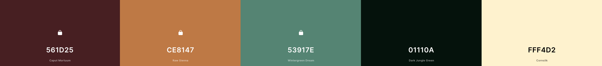

* ### Typography
The fonts used for the site are **Nunito**, **Poppins'** and **Cousine**. Fallback font for Nunito and Poppins is **sans-serif** and fallback font for Cousine is **monospace**.

* 'Nunito' is used on more or less all body text on the site. It has quite a warm and nice look which I think worked really well on the bigger chunks of text on the site.

* 'Poppins' is used on the logo in the navigation bar and on all headlines (h1 - h6). It has a really clean look and works really well as header text.

* 'Cousine' is used on all product descriptions and on the FAQ page. Maybe a little bold decision to use this font but I think its 'alternative' look works really well in the context.


[Back to top](<#table-of-content>)

# **Features**
The features of the site are listed below.

## **Existing Features**

### **Top Bar**
The top bar is always visible and includes information about free shipping. The free shipping level is connected to a variable in settings.py.

<details><summary><b>Top Bar</b></summary>


</details><br/>

### **Navigation**
The navigation bar is includes the same basic options for the user (logged in or not logged in). If the user is logged in och logged in as an administrator the sub-menus look different.

**Navigation - User Not Logged In**
* **Home** - Shows the user a carousel with two images and the latest blog posts
* **Products** - Lets the user sort/view the products by **added date**, **price**, **rating**, **name** and **all products**
* **Categories** - Lets the user sort/view the products by the categories **tapes**, **cds**, **posters**, **pins**, **t-shirts**, **tank tops**, **tote bags** and **vinyls**
* **Special Offers** -Lets the user sort/view the products by the tags **new arrivals** and **product of the month**
* **My Account** - Lets the user either **register an account** or **login**
* **Cart** - Views the total cost of the cart when the user starts adding to it. When the user clicks on it the **bag** template opens up.
* **Search Box** - Lets the user search for products on the page.

<details><summary><b>Navigation - User Not Logged In</b></summary>


</details><br/>

**Navigation - User Logged In**
When an ordinary user is logged in the **my account** gets more available options, **my profile** and **my wishlist**.

* **My Profile** - On the profile page the user can change delivery information and see the order history (and confirmations from earlier purchases)
* **My Wishlist** - On the wishlist page the user can find their wishlist that is populated when the user adds itemt to the wishlist from the product detail area. From this view the user also can remove products from the wishlist (after being promted an 'are you sure'-confirmation message)

<details><summary><b>Navigation - My Account - User Logged In</b></summary>


</details><br/>

<details><summary><b>Navigation - My Account - My Profile - Empty</b></summary>


</details><br/>

<details><summary><b>Navigation - My Account - My Profile - With Delivery Information And Order History</b></summary>


</details><br/>

<details><summary><b>Navigation - My Account - My Wishlist</b></summary>


</details><br/>

<details><summary><b>Navigation - My Account - My Wishlist - Removal Confirmation</b></summary>


</details><br/>

**Navigation - Admin Logged In**
When a superuser / administrator is logged in the **my account** gets more avilable options, **manage products** and **manage blog**

<details><summary><b>Navigation - My Account - Admin Logged In</b></summary>


</details><br/>

* **Manage Products** - On this page the administrator can add, edit, remove and search for products. The page consists of two columns. The left one is the add, edit, remove area. Here admin can add all product information including i.e. multiple tags for a product. The right column views the products in the database. Here the admin i.e. can see if the product is published or not. If the admin clicks edit on a product the form is pre-filled with all the product information (and a 'You are editing this product' gets visible in the action column). If the admin chooses to delete a product a confirmation/warning modal will be triggered. There is also possible for admin to do a search within the product management area which can be very convinient if there are a lot of products in the store. If the product is not published it will not be shown to the site users.

<details><summary><b>Navigation - Admin Logged In - Product Management</b></summary>


</details><br/>

<details><summary><b>Navigation - Admin Logged In - Product Management - Edit</b></summary>

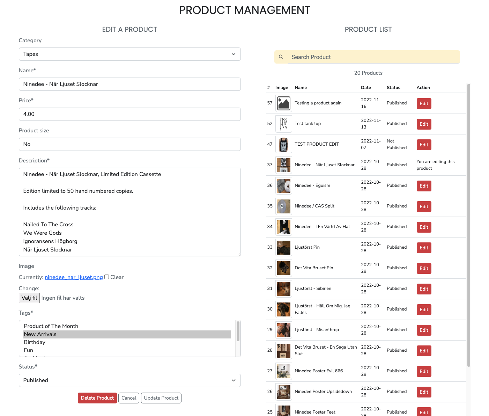

</details><br/>

<details><summary><b>Navigation - Admin Logged In - Product Management - Delete</b></summary>

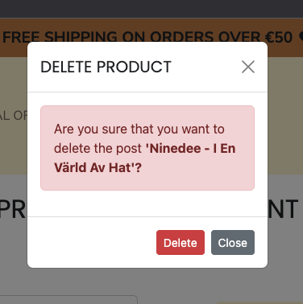

</details><br/>

<details><summary><b>Navigation - Admin Logged In - Product Management - Search</b></summary>

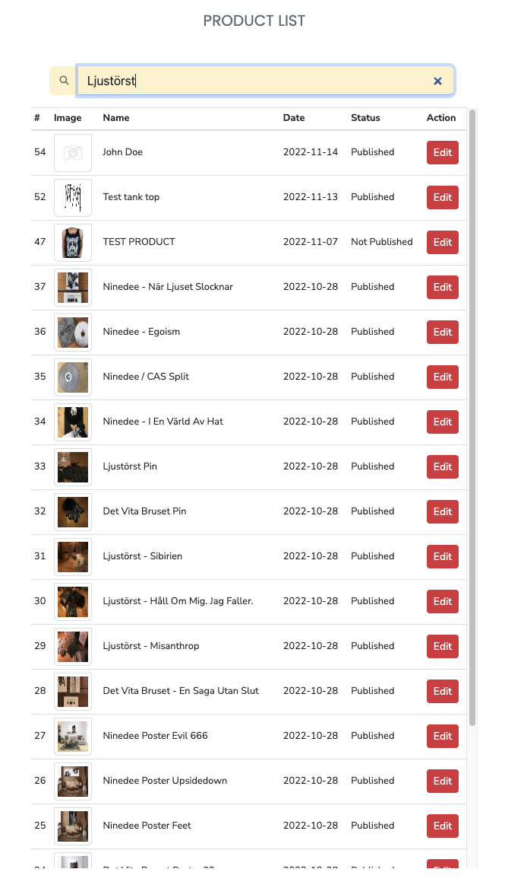

</details><br/>

<details><summary><b>Navigation - Admin Logged In - Product Management - Search Results</b></summary>


</details><br/>

* **Manage Blog** - On this page the administrator can add, edit, remove blog posts. The page consists of two columns. The left one is the add, edit, remove area. Here admin can add all blog information. The right column views the blog posts in the database. Here the admin i.e. can see if the blog post is published or not. If the admin clicks edit on a blog post the form is pre-filled with all the blog post information (and a 'You are editing this post' gets visible in the action column). If the admin chooses to delete a blog post a confirmation/warning modal will be triggered. There is also possible for admin to do a search within the blog management area which can be very convinient if there are a lot of blog posts in the store. If the blog post is not published it will not be shown to the site users.

<details><summary><b>Navigation - Admin Logged In - Blog Management</b></summary>

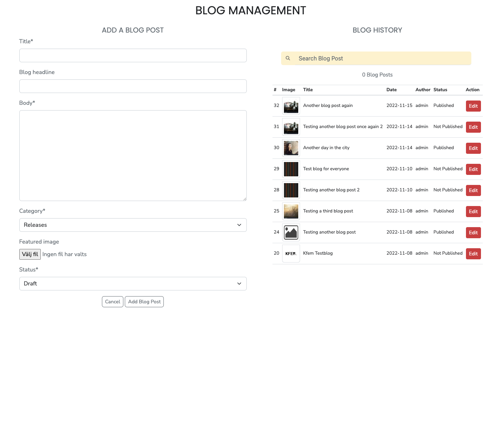

</details><br/>

<details><summary><b>Navigation - Admin Logged In - Blog Management - Edit</b></summary>


</details><br/>

<details><summary><b>Navigation - Admin Logged In - Blog Management - Delete</b></summary>

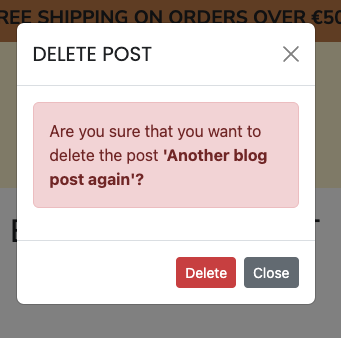

</details><br/>

<details><summary><b>Navigation - Admin Logged In - Blog Management - Search</b></summary>


</details><br/>

<details><summary><b>Navigation - Admin Logged In - Blog Management - Search Results</b></summary>


</details><br/>

### **Home**
The home page contains a carousel with two images and the latest blog posts.

**Carousel Area** - The carousel loops through two images with information and call to action buttons to shop and subscribe to the Kollektiv Fem newsletter

<details><summary><b>Carousel Area</b></summary>


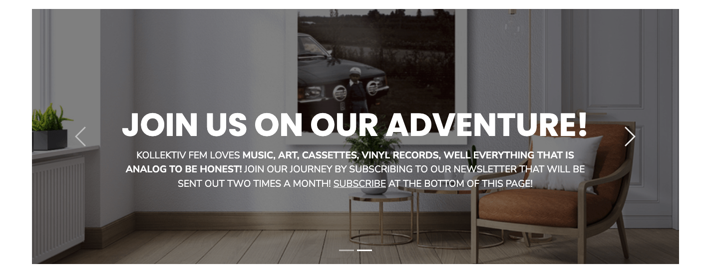
</details><br/>

**Blog Area** - The blog area shows the three latest blog posts. Above the posts there is a button that takes the user to a specific page where all the posts are being listed (the same view opens if the user clicks the 'category'-tag under the read more button, but then only blog posts with that specific category is being shown). When a site user clicks on the blog post a blog detail view is being shown. If admin is logged in there is a possibility to go to the edit blog management page from the blog area and the blog detail view (via the edit button)

<details><summary><b>Blog Area</b></summary>

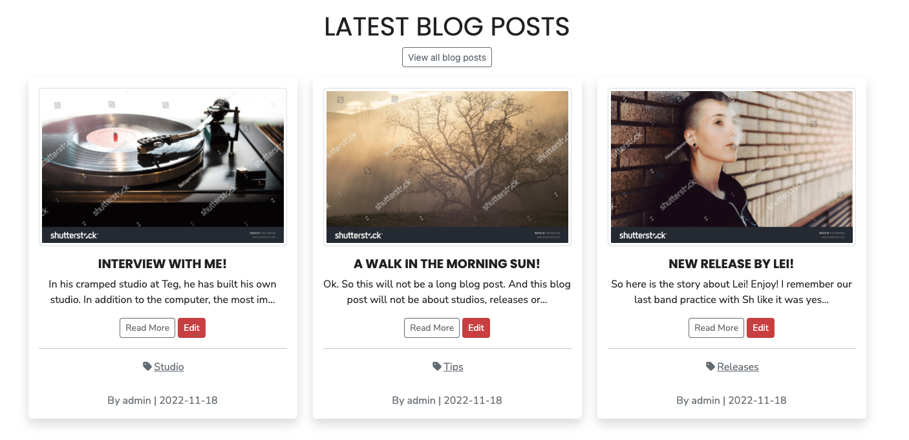
</details><br/>

<details><summary><b>Blog Detail</b></summary>

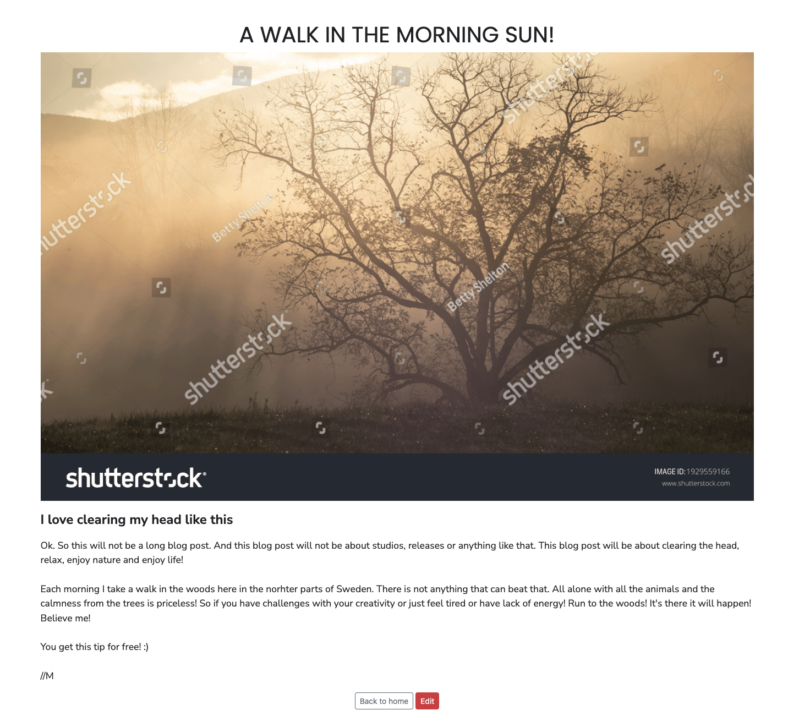
</details><br/>

**Blog - View All Blog Posts** - The View All Blog Posts Page lists all blog posts 9 at a time (before the pagination is activated). If the user has clicked the 'category' tag only blog posts with that specific category will be listed (i.e. 'Tips'). From this view it is also possible to access the blog detail page via the read more button and admin can also access the blog management via the edit button. In the bottom of the page there is also a back to home button that takes the user to the index page.

<details><summary><b>Blog - View All Blog Posts</b></summary>


</details><br/>

<details><summary><b>Blog View Blog Posts Witch Category 'Tips'</b></summary>

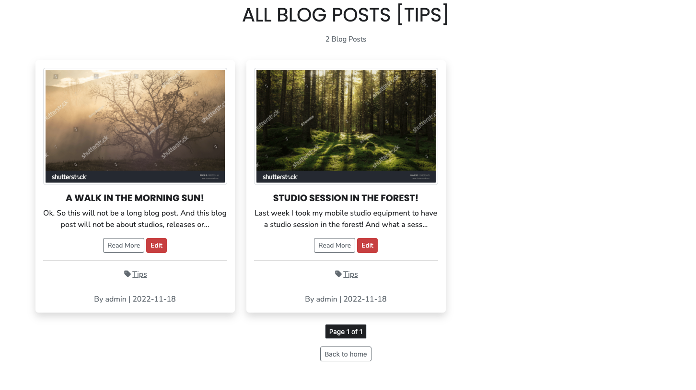
</details><br/>

### **Products**
Depending on what the site user chooses in the submenus in the menus **products**, **categories** or **special offers** the page lists different views. 9 products is listed before the pagination activates. If the user chooses a category the pagination will take that into consideration as well (even though there is a bug in the pagination if the user chooses to filter on a specific sorting). I will only show one view due to the fact it's the same visual design but just with different products being showed. In the example the products are being sorted on name (A-Z). When a site user clicks on the product a product detail page is being shown. If admin is logged in there is a possibility to go to the edit product management page from the product overview and product detail page.

<details><summary><b>Product View</b></summary>


</details><br/>

In the product detail view the user can **add the product** to the bag, add the product to the **wishlist**. If the user add the product to the wishlist the wishlist button changes to **in your wishlist**. I the product contains a size, a size option will appear on the product detail page as well.

<details><summary><b>Product Detail</b></summary>

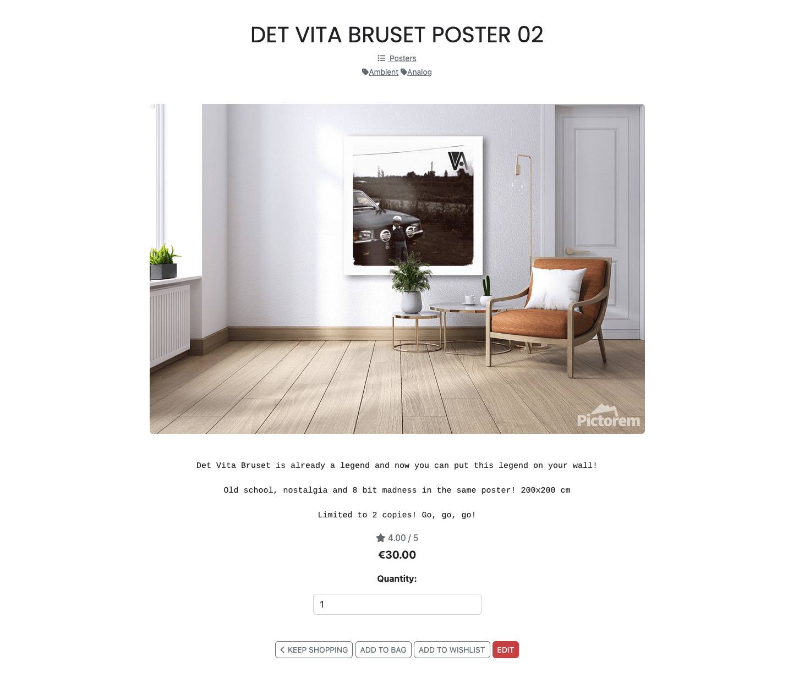
</details><br/>

<details><summary><b>Product Detail - Added To Wishlist</b></summary>


</details><br/>

<details><summary><b>Product Detail - Size</b></summary>


</details><br/>

### **Shopping Bag**
When the site user had added products by pressing the **add to bag** button the products are being stored in the shopping bag that can be accessed via the 'cart'-button in the navigation menu. In the shopping bag area the user can update and delete the products they have added and get an understandig about the total cost for the products incl. and excl. delivery cost. From this view the user can either continue to shop or go to the secure checkout page.

<details><summary><b>Shopping Bag</b></summary>


</details><br/>

### **Secure Checkout**
On the secure checkout page the user fills out a form with delivery details, card details to be able to complete the order. In the form the user has a possibility (if logged in) to save the information to the profile. If not logged in they get an option to register / sign in. On the page there is a order summary as well. If something doesn't look right the user has a possibility to adjust the bag. If the user is happy with the order summary they can use the **complete order** button to send the order for processing. The payment service used in this project is Stripe.

<details><summary><b>Secure Checkout</b></summary>


</details><br/>

<details><summary><b>Order Processing</b></summary>


</details><br/>

### **Order Confirmation**
If everything goes according to plan and the webhooks between Stripe and the site is OK an order confirmation page will be shown to the user (and a confirmation e-mail will be sent to the users registered e-mail address).

<details><summary><b>Order Confirmation</b></summary>


</details><br/>

### **Confirmation Emails**
TO BE UPDATED AFTER DEPLOYMENT

### **Sign Up**
If the site visitor has no registered user at Kollektiv Fem they can sign up.

<details><summary><b>Sign Up</b></summary>


</details><br/>

### **Sign In**
On this page the user can sign in to Kollektiv Fem.

<details><summary><b>Sign In</b></summary>


</details><br/>

### **Password Reset**
If the user has forgotten the password they can ask for a password reset through this page.

<details><summary><b>Password Reset</b></summary>


</details><br/>


</details><br/>


### **Sign Out**
When the user clicks sign out in the menu bar a confirmation page is being showed so that the user don't accidently sign out.

<details><summary><b>Sign Out</b></summary>


</details><br/>

### **Footer**
The footer area includes short information about Kollektiv Fem, links to relevant social media, a newsletter signup form (through MailChimp), a link to Kollektiv Fem on the web, a link to Kollektiv Fems privacy policy and a link to Kollektiv Fems FAQ:s (that includes commonly asked questions and a couple of useful links to Kollektiv Fems friends in the business).

<details><summary><b>Footer</b></summary>

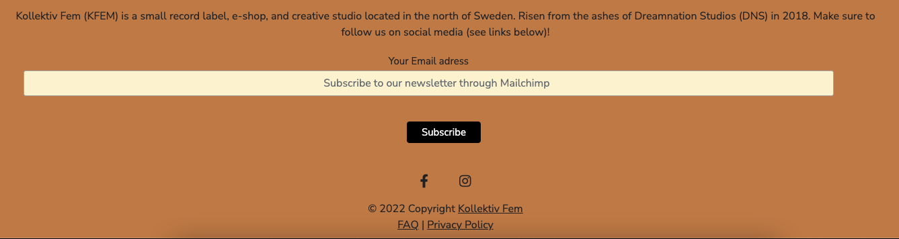
</details><br/>

<details><summary><b>Newsletter, FAQ & Privacy Policy</b></summary>


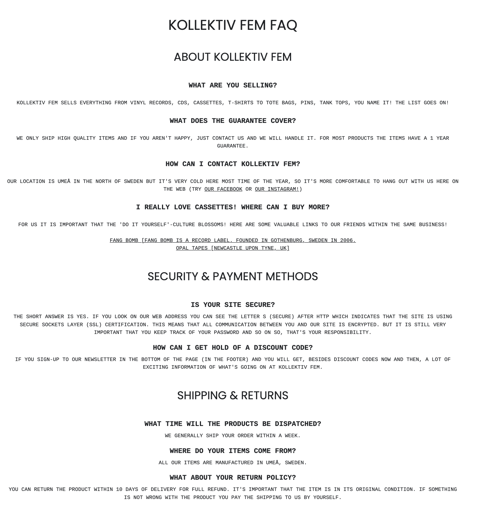

</details><br/>

### **Visual Feedback To The User**
The sites incorporates flash messages when an action has been performed (i.e. delete/update/add to bag/ actions). Examples of this in the screenshots below.

<details><summary><b>Confirmation Messages</b></summary>


</details><br/>

### Features Left to Implement

* Fix the product list pagination bug (described in the bug section)
* Give the logged in site user the possibility to add a promotion code
* Give the user the possibility to sort on multiple tags
* Give the logged in site user the possibility to rate a product
* Give the logged in site user the possibility to write a product review
* Add an admin area with general information (like number of logged in users, number of products and so on)
* Add more e-mail functionality (i.e email is being sent out when the order has been handled)

[Back to top](<#table-of-content>)

# Technologies Used

## Languages

* [Python](https://en.wikipedia.org/wiki/Python_(programming_language)) - Provides the functionality for the site.
* [HTML5](https://en.wikipedia.org/wiki/HTML) - Provides the content and structure for the website.
* [CSS3](https://en.wikipedia.org/wiki/CSS) - Provides the styling for the website.
* [JavaScript](https://en.wikipedia.org/wiki/JavaScript) - Provides interactive elements of the website

## Frameworks & Software
* [Bootstrap](https://getbootstrap.com/) - A CSS framework that helps building solid, responsive, mobile-first sites
* [Django](https://www.djangoproject.com/) - A model-view-template framework used to create the Review | Alliance site
* [Balsamiq](https://balsamiq.com/) - Used to create the wireframe.
* [Microsoft Excel](https://www.microsoft.com/sv-se/microsoft-365/excel) - Used to create testing scenarios.
* [Github](https://github.com/) - Used to host and edit the website.
* [GitBash](https://en.wikipedia.org/wiki/Bash_(Unix_shell)) - Terminal in [Gitpod](https://www.gitpod.io) used to push changes to the GitHub repository.
* [Heroku](https://en.wikipedia.org/wiki/Heroku) - A cloud platform that the application is deployed to.
* [Lighthouse](https://developer.chrome.com/docs/lighthouse/overview/) - Used to test performance of site.
* [Responsive Design Checker](https://www.responsivedesignchecker.com/) - Used for responsiveness check.
* [Wave Web Accessibility Evaluation Tool](https://wave.webaim.org/) - Used to validate the sites accessibility.
* [a11y Color Contrast Accessibility Validator](https://color.a11y.com/Contrast/) - Used to test color contrast on the site
* [Graph Models](https://django-extensions.readthedocs.io/en/latest/graph_models.html) - Used to create a *.dot file of all models in the project.
* [dreampuf](https://dreampuf.github.io/GraphvizOnline/) - Creates visually appealing database diagrams of *.dot files.
* [Favicon](https://favicon.io/) - Used to create the favicon.
* [VSCode](https://code.visualstudio.com/) - Used to create and edit the site.
* [Google Chrome DevTools](https://developer.chrome.com/docs/devtools/) - Used to debug and test responsiveness.
* [Trello](https://trello.com/en-GB) - A project management tool to organize the project.
* [Mailchimp](https://mailchimp.com/) - Used for the newsletter functionality on the site.
* [Amazon Web Services](https://aws.amazon.com/) - A service that hosts all static files and images in the project.
* [HTML Validation](https://validator.w3.org/) - Used to validate HTML code
* [CSS Validation](https://jigsaw.w3.org/css-validator/) - Used to validate CSS code
* [CI Python Linter](https://pep8ci.herokuapp.com/) - Used to lint the Python code in the project
* [JSHint Validation](https://jshint.com/) - Used to validate JavaScript code

## Libraries

[Back to top](<#table-of-content>)

The libraries used in this project are located in the requirements.txt file and have been documented below

* [asgiref](https://pypi.org/project/asgiref/) - ASGI is a standard for Python asynchronous web apps and servers to communicate with each other, and positioned as an asynchronous successor to WSGI.
* [backports.zoneinfo](https://pypi.org/project/backports.zoneinfo/) - Exposes the backports.zoneinfo module, which is a backport of the zoneinfo module.
* [boto3](https://boto3.amazonaws.com/v1/documentation/api/latest/index.html) - Is used to create, configure, and manage AWS services, such as Amazon Elastic Compute Cloud (Amazon EC2) and Amazon Simple Storage Service (Amazon S3).

* [botocore](https://botocore.amazonaws.com/v1/documentation/api/latest/index.html) - Botocore is a low-level interface to a growing number of Amazon Web Services. Botocore serves as the foundation for the AWS-CLI command line utilities.
* [dj-database-url](https://pypi.org/project/dj-database-url/) - This simple Django utility allows you to utilize the 12factor inspired DATABASE_URL environment variable to configure your Django application.)
* [Django](https://pypi.org/project/Django/) - Django is a high-level Python web framework that encourages rapid development and clean, pragmatic design.
* [django-allauth](https://pypi.org/project/django-allauth/) - Integrated set of Django applications addressing authentication, registration, account management as well as 3rd party (social) account authentication.
* [django-countries](https://pypi.org/project/django-countries/) - A Django application that provides country choices for use with forms, flag icons static files, and a country field for models.)
* [django-crispy-forms](https://pypi.org/project/django-crispy-forms/) - Used to integrate Django DRY forms in the project.
* [django-extensions](https://pypi.org/project/django-extensions/) - Django Extensions is a collection of custom extensions for the Django Framework.
* [django-storages](https://django-storages.readthedocs.io/en/latest/) - django-storages is a collection of custom storage backends for Django.
* [gunicorn](https://pypi.org/project/gunicorn/) - Gunicorn ‘Green Unicorn’ is a Python WSGI HTTP Server for UNIX. It’s a pre-fork worker model ported from Ruby’s Unicorn project. The Gunicorn server is broadly compatible with various web frameworks, simply implemented, light on server resource usage, and fairly speedy.
* [jmespath](https://pypi.org/project/jmespath/) - JMESPath (pronounced “james path”) allows you to declaratively specify how to extract elements from a JSON document.
* [oauthlib](https://pypi.org/project/oauthlib/) - OAuthLib is a framework which implements the logic of OAuth1 or OAuth2 without assuming a specific HTTP request object or web framework.
* [Pillow](https://pypi.org/project/Pillow/) - The Python Imaging Library adds image processing capabilities to your Python interpreter.
* [psycopg2](https://pypi.org/project/psycopg2/) - Psycopg is the most popular PostgreSQL database adapter for the Python programming language.
* [pydot](https://pypi.org/project/pydot/) - is an interface to Graphviz that can parse and dump into the DOT laungage.
* [PyJWT](https://pypi.org/project/PyJWT/) - A Python implementation of RFC 7519.
* [python3-openid](https://pypi.org/project/python3-openid/) - OpenID support for modern servers and consumers.
* [pytz](https://pypi.org/project/pytz/) - This is a set of Python packages to support use of the OpenID decentralized identity system in your application, update to Python 3
* [requests-oauhlib](https://pypi.org/project/requests-oauthlib/) - P    rovides first-class OAuth library support for Requests.
* [s3transfer](https://pypi.org/project/s3transfer/)- S3transfer is a Python library for managing Amazon S3 transfers. This project is maintained and published by Amazon Web Services.
* [sqlparse](https://pypi.org/project/sqlparse/) - sqlparse is a non-validating SQL parser for Python. It provides support for parsing, splitting and formatting SQL statements.
* [stripe](https://pypi.org/project/stripe/) - A Python library for Stripe’s API.

# Testing

## Testing User Stories

### Viewing And Navigation

* As a Customer I want to view a list of products so that I can read more about it and purchase it

    * At the top of the site there is a navigation bar with links that lists products based on categories, sorting or through a search query.

* As a Customer I want to click on a specific product so that I view its details like price, description, product rating, sizes and image

    * At the top of the site there is a navigation bar with links that lists products based on categories, sorting or through a search query. When a user clicks on a product a detail view of the product opens.

* As a Customer I want to read the reviews that are connected to a specific product so that I can base my purchase decision on that

    * Not implemented yet

* As a Customer I want to view the total of my purchases at any time so that I can keep track of my expenses

    * At the top of the screen the user can see the total amount of the current purchases beside the cart icon. The user can also click the cart icon to open the shopping bag page where the totals of the purchases also can be viewed.

* As a Site User I want to navigate easy on the site through paginated list of products and posts so that I feel comfortable using the site
    * On the blog posts in the home page the pagination is activated when there are more than three posts. On the product pages the pagination is activated when there are more than nine products.

* As a Site User I want to view the site owners blog post so that I can get the latest information
    * On the home page there are three blog posts visable that can be clicked on. When clicked on a blog detail page opens.

* As a Site User I want to contact Kollektiv Fem in an easy way so that I can interact with them if I have a need for it
    * In the footer there is clear information about how to contact Kollektiv Fem.

* As a Customer I want to like and unlike a review on a product I have purchased so that it is possible for me to raise my opinion
    * Not implemented yet

* As a Site User I want to get visual feedback when interacting with the content so that I can be sure how I have interacted with the page
    * When the site user performs actions on the sites flash messages shows (i.e. delete/update/add to bag/ actions).

### Registration And User Accounts

* As a Site User I want to register an account so that I have a personal account and get access to my profile
    * In the navigation bar the user can click the Register link in the My Account menu sign up for a new account. When this is done the user can access the personal account.

* As a Site User I want to have my own user profile so that I can view my personal order history, write reviews and update my contact / payment information

    * When the user has created an account and is logged in the menu My Profile in the menu takes them to a profile page were they can access personal information and order history. The write reviews function is not implemented yet.

* As a Site User I want to log out from the site so that I can feel safe that nobody can access my information
    * When the user is logged in it is possible to choose the 'Log Out'-option in the navigation menu.

### Sorting And Searching

* As a Customer I want to sort the list of all products in different ways so that I can identify the best rated, best prices and products based on category
    * At the top of the site there is a navigation bar with links that lists products based on categories, sorting or through a search query.

* As a Customer I want to sort a specific category of products so that I can identify the best rated, best prices or just sort the products by name.
    * At the top of the site there is a navigation bar with links that lists products based on categories, sorting or through a search query.

* As a Customer I can want to the list of products by using a single or multiple tags so that I can i.e. see all ’analog’ or ’ambient’ related products.
    * When the user has listed the products the tags is visible in the product cards. When the user clicks the card it is possible to choose a single tag. Multiple choice of tags not implemented yet.

* As a Customer I want to easily get information about what I have searched for and how many results the search generated so that I can see if the product is available.
    *  At the top of the site there is a navigation bar with a search field that lists the searched products.

### Purchasing And Checkout

* As a Customer I want to easily choose the quantity of a product and size if applicable when purchasing it so that that I ensure I get the correct product
    * On the product detail page the user can choose the quantity of a product and size.

* As a Customer I want to easily view the items in my cart to be purchased so that I can see the total cost and all the items I am about to receive
    * The user can easily view the cart by clicking the cart icon in the top navigation bar.

* As a Customer I want to easily adjust the amount of products in my cart so that I can change the cart before checking out
    * In the shopping bag that the user can reach by clicking the cart icon in the top navigation bar, it is easy to adjust the amount of products before checking out.

* As a Customer I want to give my payment information in an easy way so that the checkout-process is quick and easy
    * In the secure checkout page the user can in an easy way give the payment information needed for an easy checkout process.

* As a Customer I want to feel safe and secure when interacting with the site so that I feel comfortable to provide all necessary information needed for purchase
    * This is somehow subjective but the site has been build to 'radiate' a sense of professionality and stability.

* As a Customer I want to view an order confirmation after checkout so that I can secure I have purchased the correct items and everything is ok
    * When the checkout process is completed the user is taken to a confirmation success page with information about which products that have been purchased.

* As a Customer I want to receive an email confirmation after the checkout process is done so that I can keep the information for future use if needed
    * When the checkout process is completed the user recieves a confirmation e-mail to the e-mail that has been registered in the checkout process.

* As a Customer I want to receive an email confirmation when my order changes so that I get relevant information about my order
    * Not implemented yet

* As a Customer I want to create a wishlist so that I can come back later to purchase the products
    * On the product detail page the logged in user can add the specific product to their whislist and then access the wishlist from the 'my account' menu.

* As a Customer I want to use a promotion code so that I can get a better deal
    * Not implemented yet

### Site Admin

* As a Site Admin I want to search, create, update and delete product posts so that I can manage my product content
    * When admin is logged the product management page can be reached through the 'my account'-menu.

* As a Site Admin I want to log out from the site so that I can feel safe that nobody can access my information
    * When admin is logged in it is possible to choose the 'Log Out'-option in the navigation menu.

* As a Site Admin I want to create draft product posts so that I can finish writing the content later
    * In the product management page the administrator can choose to put the product in 'draft'-mode before publishing it.

* As a Site Admin I want to access an admin area so that I can get a general understanding of i.e. number of users, number of products
    * Not implemented yet

* As a Site Admin I want to get visual feedback when interacting with the content so that I can be sure how I have interacted with the page
    * When the site user performs actions on the sites flash messages shows (i.e. delete/update/add to bag/ actions).

* As a Site Admin I want to search, create, update and delete blog posts so that I can manage my blog content
    * When admin is logged the blog management page can be reached through the 'my account'-menu.

* As a Site Admin I want to create draft blog posts so that I can finish writing the content later
    * In the blog management page the administrator can choose to put the blog post in 'draft'-mode before publishing it.

[Back to top](<#table-of-content>)

## Code Validation
The code on the Kollektiv Fem site has been tested through W3C Markup Validation Service, W3C CSS Validation Service, CI Python Linter and JSHint.

### Markup Validation
 Errors were at first found on the site in the W3C Markup Validation Service but could quite easily be fixed (see bugs section). After fixing the inital errors that W3C Markup Validation Service reported, no errors were returned except 1 connected to a form on the profile page (more information about that in the bugs section).

<details><summary><b>HTML Validation Result</b></summary>


</details><br/>

[Back to top](<#table-of-content>)

### CSS Validaton
When validating my own code the W3C CSS Validator reports no errors but 16 errors connected to Bootstrap were reported.

<details><summary><b>CSS Validation Result</b></summary>

**Main CSS**


**Profile CSS**


**Checkout CSS**


</details><br/>

[Back to top](<#table-of-content>)

### PEP Validation
CI Python Linter [Code Institute Linter](https://pep8ci.herokuapp.com/) was used to validate the Python code in the project. Following files have been validated:

**App Bag**
* admin.py -  No errors reported
* apps.py -  No errors or warnings reported
* contexts.py -  No errors or warnings reported
* urls.py -  No errors or warnings reported
* views.py -  No errors or warnings reported
* bag_tools.py - No errors or warnings reported

**App Blog**
* admin.py - No errors reported
* apps.py - No errors reported
* forms.py - No errors reported
* models.py - No errors reported
* urls.py - No errors reported
* views.py - No errors reported

**App Checkout**
* __init__.py - No errors reported
* admin.py - No errors reported
* apps.py - No errors reported
* forms.py - No errors reported
* models.py - No errors reported
* signals.py - No errors reported
* urls.py - No errors reported
* views.py - No errors reported
* webhook_handler.py - 2 line-too-long errors reported which I was not able to fix before sending in to assessment
* webhooks.py - 1 line-too-long errors reported which I was not able to fix before sending in to assessment

**App Home**
* apps.py - No errors reported
* urls.py - No errors reported
* views.py - No errors reported

**App Products**
* admin.py - No errors reported
* apps.py - No errors reported
* forms.py - No errors reported
* models.py - No errors reported
* urls.py - No errors reported
* views.py - No errors reported

**App Profiles**
* apps.py - No errors reported
* forms.py - No errors reported
* models.py - No errors reported
* urls.py - No errors reported
* views.py - No errors reported

**kollektiv_fem**
* urls.py - No errors reported
* views.py - No errors reported

**other**
* custom_storages.py - No errors reported

[Back to top](<#table-of-content>)

### JavaScript Validation
The [JSHint](https://jshint.com/) validator results can be seen below:

No errors were returned when passing through JSHint but the test with no errors.

* stripe_elements.js in checkout app - No errors reported
* inline jscript in bag.html in bag app - No errors reported
* inline jscript in products.html in products app - No errors reported
* inline jscript in base.html in root templates - No errors reported
* inline jscript in footer.html in root templates - No errors reported

[Back to top](<#table-of-content>)

## Additional Testing

### Manual Testing

In addition to tests stated above I have performed a series of manual tests. Below the list of tests that has been conducted can be found.

| Status | **Main Website - User Logged Out - Navigation**
|:-------:|:--------|
| &check; | The free shipping treshold changes in the top bar changes when changing the treshold in the settings file
| &check; | Typing in a incorrect URL on the page loads the 404 error page
| &check; | Pasting page that needs authentication opens the sing in page or views a forbidden page
| &check; | Clicking the nav logo loads the home page
| &check; | Clicking the Home button on the nav bar loads the home page and views the carousel and blog posts
| &check; | Clicking the By Added Date link in the Products menu lists all products and sorts them by added date.
| &check; | Clicking the By Price link in the Products menu lists all products and sorts them by price.
| &check; | Clicking the By Rating link in the Products menu lists all products and sorts them by rating.
| &check; | Clicking the By Name link in the Products menu lists all products and sorts them by name.
| &check; | Clicking the All Products link in the Products menu lists all products.
| &check; | Clicking the Tapes link in the Categories menu lists all products within the category tape
| &check; | Clicking the CDS link in the Categories menu lists all products within the category cds
| &check; | Clicking the Posters link in the Categories menu lists all products within the category posters
| &check; | Clicking the Pins link in the Categories menu lists all products within the category pins
| &check; | Clicking the T-shirts link in the Categories menu lists all products within the category t-shirts
| &check; | Clicking the Tank Tops link in the Categories menu lists all products within the category tank tops
| &check; | Clicking the Tote Bags link in the Categories menu lists all products within the category tote bags
| &check; | Clicking the Vinyls link in the Categories menu lists all products within the category vinyls
| &check; | Clicking the New Arrivals link in the Special Offers menu lists all products with the tag new arrivals
| &check; | Clicking the Product Of The Month link in the Special Offers menu lists all products with the tag product of the month
| &check; | Clicking the Register link in the My Account menu loads the sign up page
| &check; | Clicking the Login link in the My Account menu loads the loginpage
| &check; | Clicking on the cart link in the menu bar loads the shopping bag page
| &check; | Input an empty query in the search box triggers an error messages and lists all products
| &check; | Input a valid query in the search box lists the correct products

| Status | **Main Website - User Logged Out - Carousel**
|:-------:|:--------|
| &check; | 2 images are being looped in the carousel
| &check; | On image 1 the call to action button 'Start Shopping' loads the product page and lists all products.
| &check; | On image 2 the call to action button 'Subscrib' takes the site user to the footer.
| &check; | The navigation options in the carousel is working (left / right and bottom navigation)

| Status | **Main Website - User Logged Out - Blog**
|:-------:|:--------|
| &check; | The 3 latest blog posts are rendered for the user on the home page
| &check; | Clicking the View All Blog Posts button loads the View All Blog Posts page
| &check; | The correct image and information for each blog post is being shown.
| &check; | Clicking the Read More button on a blog post card loads the blog detail page
| &check; | Clicking the Tag on the blog post card loads the blog posts with the same tags
| &check; | Clicking the Back To Home button on the blog detail page loads the home page

| Status | **Main Website - User Logged Out - Blog - View All Blog Posts**
|:-------:|:--------|
| &check; | 9 Products are rendered for the user on the product pages before pagination is activated
| &check; | Clicking the Read More button on a blog post card loads the blog detail page
| &check; | When clicking on the pagination previous / next buttons the previous / next 9 posts are being rendered
| &check; | When clicking on the pagination first / last buttons the first / last 9 posts are being rendered
dered
| &check; | When clicking on the category link all the blog posts with that category is being shown and the pagination takes the categories into consideration.
| &check; | Clicking the Back To Home button on the blog detail page loads the home page

| Status | **Main Website - User Logged Out - Products**
|:-------:|:--------|
| &check; | When using the sorting function below the product page headline the products are being sorted accordingly.
| &check; | 9 Products are rendered for the user on the product pages before pagination is activated
| &check; | When clicking on the pagination previous / next buttons the previous / next 9 products are being rendered
| &check; | When clicking on the pagination first / last buttons the first / last 9 products are being rendered
| &check; | Clicking the Read More button on a product loads the product detail page
| &check; | Clicking the Tag on the product card / product detail loads the products with the same tags
| &check; | Clicking the Category on the product card / product detail loads the products with the same category
| &check; | The correct image and information for each product is being shown
| &check; | When adding products to the cart the total updates correctly to the right of the cart symbol in the menu.
| &check; | Clicking the Keep Shopping button on the product detail page lists all products
| &check; | Clicking the Add To Bag button on the product detail page adds the quantity and size to the shopping bag and shows a flash message with the bag content and totals in the top right together (with a working link to the shopping bag)
| &check; | Clicking the Add To Wishlist button on the product detail page opens the sign-in page because wishlists only works for logged in users
| &check; | It's possible to change the quantity on the product detail page
| &check; | If the product has sizes a size dropdown is visible on the product detail page
| &check; | When clicking on the product image on the product detail page a modal opens with the image

| Status | **Main Website - User Logged Out - Shopping Bag**
|:-------:|:--------|
| &check; | The correct products and information are showing in the shopping bag (including correct sizes when product has size)
| &check; | When changing the quantity and click update the quantity updates
| &check; | When clicking the remove link the product is being removed from the shopping bag
| &check; | Clicking the Keep Shopping button on the product detail page lists all products
| &check; | Clicking the Secure Checkout button on the product detail page loads the secure checkout page

| Status | **Main Website - User Logged Out - Checkout**
|:-------:|:--------|
| &check; | The correct products, information and delivery amount are showing in the order summary (including correct sizes when product has size)
| &#10008; | The form validation is working except that the Full Name field can include numbers and the phone number field can include text
| &check; | In the bottom of the form an option log in or sign up is visible
| &check; | When clicking the Adjust Bag Button the Shopping Bag page loads
| &check; | The payment with card number is working correctly (tested with Stripe test numbers)
| &check; | The payment with card number that needs to be authenticated is working correctly (tested with Stripe test numbers). The authentication window is visible.

| Status | **Main Website - User Logged Out - Order Confirmation Page**
|:-------:|:--------|
| &check; | The correct products, information and delivery amount are showing in the order confirmation and an e-mail has been sent to the registered site user e-mail
| &check; | Webhooks are working and is confirmed in Stripe developer dashboard
| &check; | When clicking the Back To The Store button all products are being listed

| Status | **Main Website - User Logged Out - Footer**
|:-------:|:--------|
| &check; | Clicking the Instagram link in the footer area opens Instagram in a new window
| &check; | Clicking the Facebook link in the footer area opens Facebook in a new window
| &check; | Register a valid e-mail address in the e-mail signup in the footer is working
| &check; | Register a non-valid e-mail address in the e-mail signup in the footer triggers an error message
| &check; | Register a non-valid e-mail address in the e-mail signup in the footer triggers an error message
| &check; | Clicking the Kollektiv Fem link in the footer area opens the Kollektiv Fem site in a new window
| &check; | Clicking the Privacy Policy link in the footer area opens loads the privacy policy page
| &check; | Clicking the FAQ link in the footer area opens loads the FAQ page

[Back to top](<#table-of-content>)

| Status | **Main Website - User Logged In - Navigation**
|:-------:|:--------|
| &check; | The free shipping treshold changes in the top bar changes when changing the treshold in the settings file
| &check; | Typing in a incorrect URL on the page loads the 404 error page
| &check; | Pasting page that needs authentication opens the sing in page or views a forbidden page
| &check; | Clicking the nav logo loads the home page
| &check; | Clicking the Home button on the nav bar loads the home page and views the carousel and blog posts
| &check; | Clicking the By Added Date link in the Products menu lists all products and sorts them by added date.
| &check; | Clicking the By Price link in the Products menu lists all products and sorts them by price.
| &check; | Clicking the By Rating link in the Products menu lists all products and sorts them by rating.
| &check; | Clicking the By Name link in the Products menu lists all products and sorts them by name.
| &check; | Clicking the All Products link in the Products menu lists all products.
| &check; | Clicking the Tapes link in the Categories menu lists all products within the category tape
| &check; | Clicking the CDS link in the Categories menu lists all products within the category cds
| &check; | Clicking the Posters link in the Categories menu lists all products within the category posters
| &check; | Clicking the Pins link in the Categories menu lists all products within the category pins
| &check; | Clicking the T-shirts link in the Categories menu lists all products within the category t-shirts
| &check; | Clicking the Tank Tops link in the Categories menu lists all products within the category tank tops
| &check; | Clicking the Tote Bags link in the Categories menu lists all products within the category tote bags
| &check; | Clicking the Vinyls link in the Categories menu lists all products within the category vinyls
| &check; | Clicking the New Arrivals link in the Special Offers menu lists all products with the tag new arrivals
| &check; | Clicking the Product Of The Month link in the Special Offers menu lists all products with the tag product of the month
| &check; | Clicking the My Profile link the My Account menu loads the my profile page
| &check; | Clicking the My Wishlist link in the My Account menu loads the wishlist page
| &check; | Clicking on the cart link in the menu bar loads the shopping bag page
| &check; | Input an empty query in the search box triggers an error messages and lists all products
| &check; | Input a valid query in the search box lists the correct products

| Status | **Main Website - User Logged In - Carousel**
|:-------:|:--------|
| &check; | 2 images are being looped in the carousel
| &check; | On image 1 the call to action button 'Start Shopping' loads the product page and lists all products.
| &check; | On image 2 the call to action button 'Subscrib' takes the site user to the footer.
| &check; | The navigation options in the carousel is working (left / right and bottom navigation)

| Status | **Main Website - User Logged In - Blog**
|:-------:|:--------|
| &check; | The 3 latest blog posts are rendered for the user on the home page
| &check; | Clicking the View All Blog Posts button loads the View All Blog Posts page
| &check; | The correct image and information for each blog post is being shown.
| &check; | Clicking the Read More button on a blog post card loads the blog detail page
| &check; | Clicking the Tag on the blog post card loads the blog posts with the same tags
| &check; | Clicking the Back To Home button on the blog detail page loads the home page

| Status | **Main Website - User Logged In - Blog - View All Blog Posts**
|:-------:|:--------|
| &check; | 9 Products are rendered for the user on the product pages before pagination is activated
| &check; | Clicking the Read More button on a blog post card loads the blog detail page
| &check; | When clicking on the pagination previous / next buttons the previous / next 9 posts are being rendered
| &check; | When clicking on the pagination first / last buttons the first / last 9 posts are being rendered
dered
| &check; | When clicking on the category link all the blog posts with that category is being shown and the pagination takes the categories into consideration.
| &check; | Clicking the Back To Home button on the blog detail page loads the home page

| Status | **Main Website - User Logged In - Products**
|:-------:|:--------|
| &check; | When using the sorting function below the product page headline the products are being sorted accordingly.
| &check; | 9 Products are rendered for the user on the product pages before pagination is activated
| &check; | When clicking on the pagination previous / next buttons the previous / next 9 products are being rendered
| &check; | When clicking on the pagination first / last buttons the first / last 9 products are being rendered
| &check; | Clicking the Read More button on a product loads the product detail page
| &check; | Clicking the Tag on the product card / product detailloads the products with the same tags
| &check; | Clicking the Category on the product card / product detail loads the products with the same category
| &check; | The correct image and information for each product is being shown
| &check; | When adding products to the cart the total updates correctly to the right of the cart symbol in the menu.
| &check; | Clicking the Keep Shopping button on the product detail page lists all products
| &check; | Clicking the Add To Bag button on the product detail page adds the quantity and size to the shopping bag and shows a flash message with the bag content and totals in the top right together (with a working link to the shopping bag)
| &check; | Clicking the Add To Wishlist button on the product detail page adds the product to the users wishlist and changes the button to 'In Your Wishlist'
| &check; | It's possible to change the quantity on the product detail page
| &check; | If the product has sizes a size dropdown is visible on the product detail page
| &check; | When clicking on the product image on the product detail page a modal opens with the image

| Status | **Main Website - User Logged In - Shopping Bag**
|:-------:|:--------|
| &check; | The correct products and information are showing in the shopping bag (including correct sizes when product has size)
| &check; | When changing the quantity and click update the quantity updates
| &check; | When clicking the remove link the product is being removed from the shopping bag
| &check; | Clicking the Keep Shopping button on the product detail page lists all products
| &check; | Clicking the Secure Checkout button on the product detail page loads the secure checkout page

| Status | **Main Website - User Logged In - Checkout**
|:-------:|:--------|
| &check; | The correct products, information and delivery amount are showing in the order summary (including correct sizes when product has size)
| &check; | It the user has updated the profile information the information is prefilled in the form.
| &check; | In the bottom of the form an option to save the delivery inforation to the users profile is visible
| &#10008; | The form validation is working except that the Full Name field can include numbers and the phone number field can include text.
| &check; | When clicking the Adjust Bag Button the Shopping Bag page loads
| &check; | The payment with card number is working correctly (tested with Stripe test numbers)
| &check; | The payment with card number that needs to be authenticated is working correctly (tested with Stripe test numbers). The authentication window is visible.

| Status | **Main Website - User Logged In - Order Confirmation Page**
|:-------:|:--------|
| &check; | The correct products, information and delivery amount are showing in the order confirmation and an e-mail has been sent to the registered site user e-mail
| &check; | Webhooks are working and is confirmed in Stripe developer dashboard
| &check; | When clicking the Back To The Store button all products are being listed

| Status | **Main Website - User Logged In - Footer**
|:-------:|:--------|
| &check; | Clicking the Instagram link in the footer area opens Instagram in a new window
| &check; | Clicking the Facebook link in the footer area opens Facebook in a new window
| &check; | Register a valid e-mail address in the e-mail signup in the footer is working
| &check; | Register a non-valid e-mail address in the e-mail signup in the footer triggers an error message
| &check; | Register a non-valid e-mail address in the e-mail signup in the footer triggers an error message
| &check; | Clicking the Kollektiv Fem link in the footer area opens the Kollektiv Fem site in a new window
| &check; | Clicking the Privacy Policy link in the footer area opens loads the privacy policy page
| &check; | Clicking the FAQ link in the footer area opens loads the FAQ page

[Back to top](<#table-of-content>)

| Status | **Main Website - Admin Logged In - Navigation**
|:-------:|:--------|
| &check; | The free shipping treshold changes in the top bar changes when changing the treshold in the settings file
| &check; | Typing in a incorrect URL on the page loads the 404 error page
| &check; | Pasting page that needs authentication opens the sing in page or views a forbidden page
| &check; | Clicking the nav logo loads the home page
| &check; | Clicking the Home button on the nav bar loads the home page and views the carousel and blog posts
| &check; | Clicking the By Added Date link in the Products menu lists all products and sorts them by added date.
| &check; | Clicking the By Price link in the Products menu lists all products and sorts them by price.
| &check; | Clicking the By Rating link in the Products menu lists all products and sorts them by rating.
| &check; | Clicking the By Name link in the Products menu lists all products and sorts them by name.
| &check; | Clicking the All Products link in the Products menu lists all products.
| &check; | Clicking the Tapes link in the Categories menu lists all products within the category tape
| &check; | Clicking the CDS link in the Categories menu lists all products within the category cds
| &check; | Clicking the Posters link in the Categories menu lists all products within the category posters
| &check; | Clicking the Pins link in the Categories menu lists all products within the category pins
| &check; | Clicking the T-shirts link in the Categories menu lists all products within the category t-shirts
| &check; | Clicking the Tank Tops link in the Categories menu lists all products within the category tank tops
| &check; | Clicking the Tote Bags link in the Categories menu lists all products within the category tote bags
| &check; | Clicking the Vinyls link in the Categories menu lists all products within the category vinyls
| &check; | Clicking the New Arrivals link in the Special Offers menu lists all products with the tag new arrivals
| &check; | Clicking the Product Of The Month link in the Special Offers menu lists all products with the tag product of the month
| &check; | Clicking the My Profile link the My Account menu loads the my profile page
| &check; | Clicking the My Wishlist link in the My Account menu loads the wishlist page
| &check; | Clicking the My Manage Products link the My Account menu loads the my product management page
| &check; | Clicking the Manage Blog link in the My Account menu loads the blog management page
| &check; | Clicking on the cart link in the menu bar loads the shopping bag page
| &check; | Input an empty query in the search box triggers an error messages and lists all products
| &check; | Input a valid query in the search box lists the correct products

| Status | **Main Website - Admin Logged In - Carousel**
|:-------:|:--------|
| &check; | 2 images are being looped in the carousel
| &check; | On image 1 the call to action button 'Start Shopping' loads the product page and lists all products.
| &check; | On image 2 the call to action button 'Subscrib' takes the site user to the footer.
| &check; | The navigation options in the carousel is working (left / right and bottom navigation)

| Status | **Main Website - Admin Logged In - Blog**
|:-------:|:--------|
| &check; | The 3 latest blog posts are rendered for the user on the home page
| &check; | Clicking the View All Blog Posts button loads the View All Blog Posts page
| &check; | The correct image and information for each blog post is being shown.
| &check; | Clicking the Read More button on a blog post card loads the blog detail page
| &check; | Clicking the Tag on the blog post card loads the blog posts with the same tags
| &check; | Clicking the Back To Home button on the blog detail page loads the home page
| &check; | When clicking the Edit button to the right of the Read More button below the blog post the blog management edit page is loaded

| Status | **Main Website - Admin Logged In - Blog - View All Blog Posts**
|:-------:|:--------|
| &check; | 9 Products are rendered for the user on the product pages before pagination is activated
| &check; | Clicking the Read More button on a blog post card loads the blog detail page
| &check; | When clicking on the pagination previous / next buttons the previous / next 9 posts are being rendered
| &check; | When clicking on the pagination first / last buttons the first / last 9 posts are being rendered
dered
| &check; | When clicking on the category link all the blog posts with that category is being shown and the pagination takes the categories into consideration.
| &check; | Clicking the Back To Home button on the blog detail page loads the home page
| &check; | When clicking the Edit button to the right of the Read More button below the blog post the blog management edit page is loaded

| Status | **Main Website - Admin Logged In - Products**
|:-------:|:--------|
| &check; | When using the sorting function below the product page headline the products are being sorted accordingly.
| &check; | 9 Products are rendered for the user on the product pages before pagination is activated
| &check; | When clicking on the pagination previous / next buttons the previous / next 9 products are being rendered
| &check; | When clicking on the pagination first / last buttons the first / last 9 products are being rendered
| &check; | Clicking the Read More button on a product loads the product detail page
| &check; | Clicking the Tag on the product card / product detail loads the products with the same tags
| &check; | Clicking the Category on the product card / product detail loads the products with the same category
| &check; | When clicking the Edit button to the right of the Read More button below the product the product management edit page is loaded
| &check; | The correct image and information for each product is being shown
| &check; | When adding products to the cart the total updates correctly to the right of the cart symbol in the menu.
| &check; | Clicking the Keep Shopping button on the product detail page lists all products
| &check; | Clicking the Add To Bag button on the product detail page adds the quantity and size to the shopping bag and shows a flash message with the bag content and totals in the top right together (with a working link to the shopping bag)
| &check; | Clicking the Add To Wishlist button on the product detail page adds the product to the users wishlist and changes the button to 'In Your Wishlist'
| &check; | It's possible to change the quantity on the product detail page
| &check; | If the product has sizes a size dropdown is visible on the product detail page
| &check; | When clicking on the product image on the product detail page a modal opens with the image
| &check; | When clicking the Edit button to the right of the Add To The Wishlist button below the product the product management edit page is loaded

| Status | **Main Website - Admin Logged In - Product Management - Add Product**
|:-------:|:--------|
| &check; | The form validation is working and does not accept negative numbers on price field
| &check; | When setting the status to draft the product is not visible in the product list for ordinary users
| &check; | When not adding an image to the product a default image is being used instead automatically
| &check; | When doing a search in the product list the correct products are being shown in the list (and the correct amount is being shown as well)
| &check; | When clicking the Cancel button the standard product view is being loaded and all products are being listed
| &check; | When clicking the Add Product button the standard product view is being loaded viewing the newly added product

| Status | **Main Website - Admin Logged In - Product Management - Edit Product**
|:-------:|:--------|
| &check; | When clicking the Edit button the form is prefilled with the product information and the action is changed to 'You are editing this product'.
| &check; | When clicking the Delete Product button a warning modal is being loaded for confirmation. After confirmation the Add Product page is being loaded
| &check; | When doing a search in the blog history list the correct blog posts are being shown in the list (and the correct amount is being shown as well)
| &check; | When clicking the Cancel button the Add Product page is being loaded
| &check; | When clicking the Update button Product Detail page is being loaded viewing the newly updated product

| Status | **Main Website - Admin Logged In - Blog Management - Add Blog Post**
|:-------:|:--------|
| &check; | The form validation is working
| &check; | When setting the status to draft the blog post is not visible in the blog area on the home page for ordinary users
| &check; | When not adding an image to the blog post a default image is being used instead automatically
| &check; | When clicking the Cancel button the home page is being loaded
| &check; | When clicking the Add Blog Post button the product detail is being loaded viewing the newly created blog post
| &check; | When doing a search in the blog history list the correct blog posts are being shown in the list (and the correct amount is being shown as well)

| Status | **Main Website - Admin Logged In - Product Management - Edit Blog Post**
|:-------:|:--------|
| &check; | When clicking the Edit button the form is prefilled with the blog post information and the action is changed to 'You are editing this post'.
| &check; | When clicking the Delete Post button a warning modal is being loaded for confirmation. After confirmation the Add Blog Post page is being loaded
| &check; | When clicking the Cancel button the Add Blog Post page is being loaded
| &check; | When clicking the Update button Blog Post Detail page is being loaded viewing the newly updated blog post
| &check; | When doing a search in the blog history list the correct blog posts are being shown in the list (and the correct amount is being shown as well)

| Status | **Main Website - Admin Logged In - Shopping Bag**
|:-------:|:--------|
| &check; | The correct products and information are showing in the shopping bag (including correct sizes when product has size)
| &check; | When changing the quantity and click update the quantity updates
| &check; | When clicking the remove link the product is being removed from the shopping bag
| &check; | Clicking the Keep Shopping button on the product detail page lists all products
| &check; | Clicking the Secure Checkout button on the product detail page loads the secure checkout page

| Status | **Main Website - Admin Logged In - Checkout**
|:-------:|:--------|
| &check; | The correct products, information and delivery amount are showing in the order summary (including correct sizes when product has size)
| &check; | It the user has updated the profile information the information is prefilled in the form.
| &check; | If the bottom of the form an option to save the delivery inforation to the users profile is visible
| &#10008; | The form validation is working except that the Full Name field can include numbers and the phone number field can include text.
| &check; | When clicking the Adjust Bag Button the Shopping Bag page loads
| &check; | The payment with card number is working correctly (tested with Stripe test numbers)
| &check; | The payment with card number that needs to be authenticated is working correctly (tested with Stripe test numbers). The authentication window is visible.

| Status | **Main Website - Admin Logged In - Order Confirmation Page**
|:-------:|:--------|
| &check; | The correct products, information and delivery amount are showing in the order confirmation and an e-mail has been sent to the registered site user e-mail
| &check; | Webhooks are working and is confirmed in Stripe developer dashboard
| &check; | When clicking the Back To The Store button all products are being listed

| Status | **Main Website - Admin Logged In - Footer**
|:-------:|:--------|
| &check; | Clicking the Instagram link in the footer area opens Instagram in a new window
| &check; | Clicking the Facebook link in the footer area opens Facebook in a new window
| &check; | Register a valid e-mail address in the e-mail signup in the footer is working
| &check; | Register a non-valid e-mail address in the e-mail signup in the footer triggers an error message
| &check; | Register a non-valid e-mail address in the e-mail signup in the footer triggers an error message
| &check; | Clicking the Kollektiv Fem link in the footer area opens the Kollektiv Fem site in a new window
| &check; | Clicking the Privacy Policy link in the footer area opens loads the privacy policy page
| &check; | Clicking the FAQ link in the footer area opens loads the FAQ page

[Back to top](<#table-of-content>)

### Automated Testing
No automated testing has been done during this project.

### Responsiveness Test
The responsive design tests were carried out manually with [Google Chrome DevTools](https://developer.chrome.com/docs/devtools/) and [Responsive Design Checker](https://www.responsivedesignchecker.com/).

| Desktop    | Display <1280px       | Display >1280px    |
|------------|-----------------------|--------------------|
| Render     | pass                  | pass               |
| Images     | pass                  | pass               |
| Links      | pass                  | pass               |

| Tablet     | Samsung Galaxy Tab 10 | Amazon Kindle Fire | iPad Mini | iPad Pro |
|------------|-----------------------|--------------------|-----------|----------|
| Render     | pass                  | pass               | pass      | pass     |
| Images     | pass                  | pass               | pass      | pass     |
| Links      | pass                  | pass               | pass      | pass     |

| Phone      | Galaxy S5/S6/S7       | iPhone 6/7/8       | iPhone 12pro         |
|------------|-----------------------|--------------------|----------------------|
| Render     | pass                  | pass               | pass      | pass     |
| Images     | pass                  | pass               | pass      | pass     |
| Links      | pass                  | pass               | pass      | pass     |

[Back to top](<#table-of-content>)

### Browser Compatibility
* Google Chrome Version (107.0.5304.110)
* Mozilla Firefox (version 107.0)
* Min (version 1.26.0)
* Apple Safari (version 16.0)
* Microsoft Edge (version 107.0.1418.42)

[Back to top](<#table-of-content>)

### Lighthouse
Google Lighthouse in Chrome Developer Tools was used to test the application within the areas of *Performance*, *Accessibility*, *Best Practices* and *SEO*. I tested the *home page*, *view all blog posts page*, *view all products page*, *product management page* and *blog management page*. The testing showed the following:

* Home Page - Performance: 70, Accessibility: 100, Best Practises: 100, SEO: 92
* View All Blog Posts Page - Performance: 68, Accessibility: 100, Best Practises: 100, SEO: 92
* View All Products Page - Performance: 64, Accessibility: 99, Best Practises: 100, SEO: 92
* Product Management - Performance: 75, Accessibility: 100, Best Practises: 100, SEO: 100
* Blog Management - Performance: 75, Accessibility: 100, Best Practises: 100, SEO: 100

From a general point of view this are quite good results. On all pages the performance is a little bit to low and it is mainly connected to the image sizes. I did some compressing on all the images(approx -50% in size) but still the performance result landed around 70-80. The decrease in the SEO results are mainly connected to the 'read more' links that is not a optimal description from a SEO point of view. In the view all products page the SEO result is affected by the heading elements not being in sequentially-descending order, but this is an active design choice and not a big issue (but I thought it would be proper to highlight it here so that it's clear I'm aware of it).

<details><summary><b>Lighthouse Home Result</b></summary>


</details><br/>

<details><summary><b>Lighthouse View All Blog Posts Page Result</b></summary>


</details><br/>

<details><summary><b>Lighthouse View All Products Page Result</b></summary>


</details><br/>

<details><summary><b>Lighthouse Product Management Result</b></summary>


</details><br/>

<details><summary><b>Lighthouse Blog Management Result</b></summary>


</details><br/>

### WAVE
[WAVE](https://wave.webaim.org/) was used to check accessibility. 2 errors were found (1 missing form label and 1 contrast error). The missing form label is connected to the Mailchimp code why I don't want to change anything there. The contrast error is connected to the carousel but when I run the check in other contrast checking software there is no error. So I decided to keep it as it is.

<details><summary><b>WAVE Result</b></summary>


</details><br/>

### a11y Color Contrast Accessibility Validator
[a11y](https://color.a11y.com/Contrast/) was used to check the color contrast accessibility. 0 errors were found.

<details><summary><b>a11y Result</b></summary>


</details><br/>

[Back to top](<#table-of-content>)

### Peer Review
Additional testing of the application was conducted by people outside of the software development field. Some smaller spelling and grammar errors were found on the site and corrected. No major challenges connected to the design or handling of the site.

## Known bugs
No known bugs besides those in the fixed / unfixed bugs section.

### Fixed Bugs
**2022-11-10**
* Bug: When trying to log in to the site locally a CSRF verification failed appears. This fail was connected to CSRF Trusted Origins which could be fixed by adding a row to settings.py. It is a little bit of a hassle to change the address from time to time due to that the local adress changes.

<details><summary><b>CSRF Fail</b></summary>


</details><br/>

**2022-11-10**
* Bug: I got an Uncaught TypeError connected to the toast messages. This hade to do with me using a newer version of Bootstrap which could be easily fixed.

**2022-11-11**
* Bug: I got quite a lot of problems when I deployed the site to Heroku the first time. I got a 'failed to build backports.zoneinfo'. It was actually quite an easy fix. I added a runtime.txt to the root folder with information about what python version Heroku should install to work with the Heroku version at the time.

**2022-11-14**
* Bug: My mentor noticed that it was possible to add a negative number in the price field when adding a product in the product management area. I fixed this by adding a validation check in the product model (MinValueValidator).

<details><summary><b>Negative Price Bug</b></summary>


</details><br />

**2022-11-16**
* Bug: The CSS Validation reported an error that is connected to Bootstrap. When I validate my own CSS code there are no errors at all. So this might be a Font Awesome bug that is out of my control. But I thought it would be proper to highlight the error here in the bugs section.

* Bug: The HTML Validation reported some errors that could be quite easily fixed.

<details><summary><b>HTML Validator Error</b></summary>

**HTML Validator Error Home**


**HTML Validator Error Wishlist**


**HTML Validator Error Remove Wishlist**


**HTML Validator Error Footer**


**HTML Validator Error Profile**

</details><br />

### Unfixed Bugs

**2022-11-10**
* Bug: The Pagination on the site works really well except when the user chooses a specific category or a specific sorting. The problem is when the user clicks the next/previous button on the pagination the category/sorting attribute disappears which means that the next/previous pagination page does not take the users choice into consideration. I managed to fix parts of the problem and had two sessions with two different tutors without success. I tried to solve the problem by adding if statements in the url to keep the category/sorting but it quite fast got really complex. Me and the tutors discussed if it could be easier to handle it from the product views but I needed to move on with the project to not get stuck on this issue to long. The pagination works as it should with the exception when the user chooses category/sorting. Here is an example of the code that partly worked (which I removed in the deployed project. **2022-11-17** *Update: Since this bug was noticed I have added a view all blog posts (and possibility for the user to view all blog posts with a specific category). This means that the pagination bug is fixed on the view all blog posts template.* **2022-11-18** *Update: I have now fixed one bug connected to the list all products-view, the pagination now takes category into consideration if the uses chooses to filter the products on category.*
```

<li class="page-item"><a class="page-link" href="
        ?page={{ product_list.next_page_number }}
        ?page={{ product_list.next_page_number }}&category={{ category }}
        ?page={{ product_list.next_page_number }}??page={{ product_list.next_page_number }}&q= {{ search_term }}
        ?page={{ product_list.next_page_number }}&sort={{ sort }}&direction={{ direction }}
        ?page={{ product_list.next_page_number }}&sort={{ sort }}&direction={{ direction }}
        ?page={{ product_list.next_page_number }}
        ">Next</a>
</li>
```

**2022-11-14**
* Bug: In the checkout form it is possible for the user to add ordinary letters in the phone number field. I have done some digging and it could be possible to use a validator but I haven't gotten it to work fully. I need to prioritize the rest of the project for now, why this bug is unfixed for now.
* Bug: In the checkout form it is possible for the user to add numerals in the name field. I have done some digging and it could be possible to use a validator but I haven't gotten it to work fully. I need to prioritize the rest of the project for now, why this bug is unfixed for now.

**2022-11-17**
* Bug: The HTML Validator Error connected to the Profile Page has not been corrected yet. I haven't been able to correct it without risking to break the rest of the page. The error is connected to the attribute placeholder not allowed on the select element. The form code for this section is based on the 'Boutique Ado' project with quite complex looping through the form fields. So for now I will not fix it due to the need to prioritize the rest of the project but of course if I would use the site in a live situation I would fix it. Actually if I could do the form again I would not use a loop functionality due to **unnecessary** added complexity.

**2022-11-18**
* Bug: On the add_product.html (Product Management) page the drop-down arrow on the size field is missing. I have tried several fixes without success so I decided to keep it as it is. If the site would have gone live I would have invested more time to fix the bug.

[Back to top](<#table-of-content>)

# Deployment

## Deployment To Heroku

The project was deployed to [Heroku](https://www.heroku.com). To deploy, please follow the process below:

1. To begin with we need to create a GitHub repository from the [Code Institute template](https://github.com/Code-Institute-Org/gitpod-full-template) by following the link and then click 'Use this template'.

<details><summary><b>Heroku Deployment - Step 1</b></summary>


</details><br />

2. Fill in the needed details as stated in the screenshot below and then click 'Create Repository From Template'.

<details><summary><b>Heroku Deployment - Step 2</b></summary>


</details><br />

3. When the repository creation is done click 'Gitpod' as stated in the screenshot below.

<details><summary><b>Heroku Deployment - Step 3</b></summary>


</details><br />

4. Now it's time to install Django and the supporting libraries that are needed. Type the commands below to do this.

* ```pip3 install 'django<4' gunicorn```
* ```pip3 install 'dj_database_url psycopg2```
* ```pip3 install 'dj3-cloudinary-storage```

<details><summary><b>Heroku Deployment - Step 4</b></summary>


</details><br />

5. When Django and the libraries are installed we need to create a requirements file.

* ```pip3 freeze --local > requirements.txt``` - This will create and add required libraries to requirements.txt

<details><summary><b>Heroku Deployment - Step 5</b></summary>

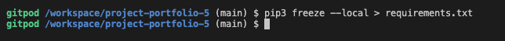
</details><br />

6. Now it's time to create the project.

* ```django-admin startproject YOUR_PROJECT_NAME .``` - This will create your project

<details><summary><b>Heroku Deployment - Step 6</b></summary>


</details><br />

7. When the project is created we can now create the application.

* ```python3 manage.py startapp APP_NAME``` - This will create your application

<details><summary><b>Heroku Deployment - Step 7</b></summary>


</details><br />

8. We now need to add the application to settings.py

<details><summary><b>Heroku Deployment - Step 8</b></summary>

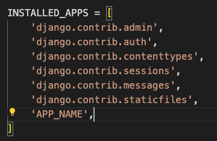
</details><br />

8. Now it is time to do our first migration and run the server to test that everything works as expected. This is done by writing the commands below.

* ```python3 manage.py migrate``` - This will migrate the changes
* ```python3 manage.py runserver``` - This runs the server. To test it, click the open browser button that will be visible after the command is run.

9. Now it is time to create our application on Heroku, attach a database, prepare our environment and settings.py file and setup the Cloudinary storage for our static and media files.

* Head on to [Heroku](https://www.heroku.com/) and sign in (or create an account if needed).

* In the top right corner there is a button that is labeled 'New'. Click that and then select 'Create new app'.

<details><summary><b>Heroku Step 09</b></summary>


</details><br />

10. Now it's time to enter an application name that needs to be unique. When you have chosen the name, choose your region and click 'Create app".

<details><summary><b>Heroku Step 10</b></summary>


</details><br />

11. To add a database to the app you need to go to the resources tab ->> add-ons, search for 'Heroku Postgres' and add it.

<details><summary><b>Heroku Step 11</b></summary>


</details><br />

12. Go to the settings tab and click on the reveal Config Vars button. Copy the text from DATABASE_URL (because we are going to need it in the next step).

<details><summary><b>Heroku Step 12</b></summary>


</details><br />

13. Go back to GitPod and create a new env.py in the top level directory. Then add these rows.

* ```import os``` - This imports the os library
* ```os.environ["DATABASE_URL_FROM HEROKU"]``` - This sets the environment variables.
* ```os.environ["SECRET_KEY"]``` - Here you can choose whatever secret key you want.

<details><summary><b>Heroku Step 13</b></summary>


</details><br />

14. Now we are going to head back to Heroku to add our secret key to config vars. See screenshot below.

<details><summary><b>Heroku Step 14</b></summary>

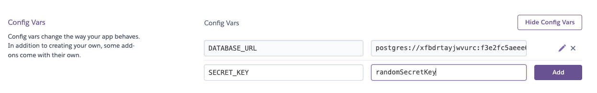
</details><br />

15. Now we have some preparations to do connected to our environment and settings.py file. In the settings.py, add the following code:

```import os```

```import dj_database_url```

```if os.path.isfile("env.py"):```

```import env```

<details><summary><b>Heroku Step 15</b></summary>


</details><br />

16. In the settings file, remove the insecure secret key and replace it with:
```SECRET_KEY = os.environ.get('SECRET_KEY')```

<details><summary><b>Heroku Step 16</b></summary>

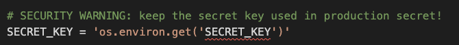
</details><br />

17. Now we need to comment out the old database setting in the settings.py file (this is because we are going to use the postgres database instead of the sqlite3 database).

<details><summary><b>Heroku Step 17 1/2</b></summary>


</details><br />

Now, add the link to the DATABASE_URL that we added to the environment file earlier.

<details><summary><b>Heroku Step 17 2/2</b></summary>


</details><br />

18. Save all your fields and migrate the changes.

```python3 manage.py migrate```

19. Now we are going to get our connection to Cloudinary connection working (this is were we will store our static files). First you need to create a Cloudinary account and from the Cloudinary dashboard copy the API Environment Variable.

20. Go back to the env.py file in Gitpod and add the Cloudinary url (it's very important that the url is correct):

```os.environ["CLOUDINARY_URL"] = "cloudinary://************************"```

21. Let's head back to Heroku and add the Cloudinary url in Config Vars. We also need to add a disable collectstatic variable to get our first deployment to Heroku to work.

<details><summary><b>Heroku Step 21</b></summary>


</details><br />

22. Let's head back to our settings.py file on Gitpod. We now need to add our Cloudinary Libraries we installed earlier to the installed apps. Here it is important to get the order correct.

<details><summary><b>Heroku Step 22</b></summary>


</details><br />

23. For Django to be able to understand how to use and where to store static files we need to add some extra rows to the settings.py file.

<details><summary><b>Heroku Step 23</b></summary>


</details><br />

24. Hang in there, we have just a couple of steps left. Now it's time to link the file to the Heroku templates directory.

<details><summary><b>Heroku Step 24</b></summary>


</details><br />

25. Let's change the templates directory to TEMPLATES_DIR in the teamplates array.

<details><summary><b>Heroku Step 25</b></summary>


</details><br />

26. To be able to get the application to work through Heroku we also need to add our Heroku app and localhost to which hosts that are allowed.

<details><summary><b>Heroku Step 26</b></summary>


</details><br />

27. Now we just need to add some files to Gitpod.

* Create 3 folders in the top level directory: **media**, **static**, **templates**
* Create a file called **Procfile* and add the line ```web: gunicorn PROJ_NAME.wsgi?``` to it.d

28. Now you can save all the files and prepare for the first commit and push to Github by writing the lines below.

* ```git add .```
* ```git commit -m "Deployment Commit```
* ```git push```

29. Before moving on to the Heroku deployment we just need to add one more thing in the config vars. We need to add "PORT" in the KEY input field and "8000" in the VALUE field. If we don't add this there might be problems with the deployment.

30. Now it's time for deployment. Scroll to the top of the settings page in Heroku and click the 'Deploy' tab. For deployment method, select 'Github'. Search for the repository name you want to deploy and then click connect.

31. Scroll down to the manual deployment section and click 'Deploy Branch'. Hopefully the deployment is successful!

<details><summary><b>Heroku Step 31</b></summary>


</details><br />

The live link to the 'Review | Alliance' site on Heroku an be found [here](https://project-portfolio-4.herokuapp.com/). And the Github repository can be found [here](https://github.com/worldofmarcus/project-portfolio-4).

[Back to top](<#table-of-content>)

## How To Fork The Repository On GitHub

It is possible to do a independent copy of a GitHub Repository by forking the GitHub account. The copy can then be viewed and it is also possible to do changes in the copy without affecting the original repository. To fork the repository, take these steps:

1. After logging in to GitHub, locate the repository. On the top right side of the page there is a 'Fork' button. Click on the button to create a copy of the original repository.

<details><summary><b>Github Fork</b></summary>


</details><br />

[Back to top](<#table-of-content>)

## Cloning And Setting Up This Project

To clone and set up this project you need to follow the steps below.

1. When you are in the repository, find the code tab and click it.
2. To the left of the green GitPod button, press the 'code' menu. There you will find a link to the repository. Click on the clipboard icon to copy the URL.
3. Use an IDE and open Git Bash. Change directory to the location where you want the cloned directory to be made.
4. Type 'git clone', and then paste the URL that you copied from GitHub. Press enter and a local clone will be created.

<details><summary><b>Github Create Local Clone</b></summary>


</details><br />

5. To be able to get the project to work you need to install the requirements. This can be done by using the command below:

* ```pip3 install -r requirements.txt``` - This command downloads and install all required dependencies that is stated in the requirements file.

6. The next step is to set up the environment file so that the project knows what variables that needs to be used for it to work. Environment variables are usually hidden due to sensitive information. It's very important that you don't push the env.py file to Github (this can be secured by adding env.py to the .gitignore-file). The variables that are declared in the env.py file needs to be added to the Heroku config vars. Don't forget to do necessary migrations before trying to run the server.

* ```python3 manage.py migrate``` - This will do the necessary migrations.
* ```python3 manage.py runserver``` - If everything i setup correctly the project is now live locally.

<details><summary><b>Setup env.py</b></summary>


</details><br />

[Back to top](<#table-of-content>)

# Credits

## Content

* All text content written by Marcus Eriksson.

* Blog images taken from [Shutterstock](https://www.shutterstock.com/sv)

* Product images and text taken from [Kollektiv Fem](https://www.kollektivfem.se) which is owned by Marcus Eriksson.

* The poster images was converted to posters through [Pictorem](https://www.pictorem.com/).

* The tote bag, tank top and t-shirt images was converted to product images through [Printify](https://printify.com/).

* Featured default review image taken from [FAVPNG](https://favpng.com/png_view/download-clip-art-png/hHNmGh4R)

* Template for read.me provided by Code Institute (*with some additional changes that my mentor [Precious Ijege](https://www.linkedin.com/in/precious-ijege-908a00168/))* suggested.

## Technical

* Inspiration regarding UpdateView taken from [Learn Django Class Based Views](https://www.youtube.com/watch?v=EUUjJdw3EBM)

* Formatting date format [Formatting Date, Time, and Numbers in Django Templating](https://collinshillary1.medium.com/formatting-date-time-and-numbers-in-django-templating-f53fea027a06)

* Inspiration regarding CSS code to add circle around text [How to Add a Circle Around a Number in CSS](https://www.w3docs.com/snippets/css/how-to-add-a-circle-around-a-number-in-css.html)

* Inspiration regarding adding extra forms in Django Allauth form [How to add more custom fields on signup form?](https://stackoverflow.com/questions/68591755/django-allauth-how-to-add-more-custom-fields-on-signup-form)

# Acknowledgements
This fictional site was created for Portfolio Project #5 (E-Commerce Applications Portfolio Project) - Diploma in Full Stack Software Development Diploma at the [Code Institute](https://www.codeinstitute.net). I would like to thank my mentor [Precious Ijege](https://www.linkedin.com/in/precious-ijege-908a00168/) for relevant feedback during the project.

*Marcus Eriksson, 2022-11-22*

[Back to top](<#table-of-content>)